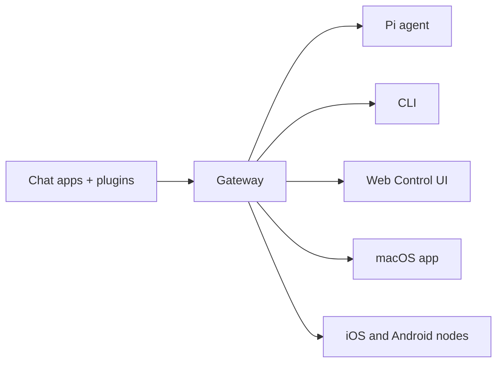
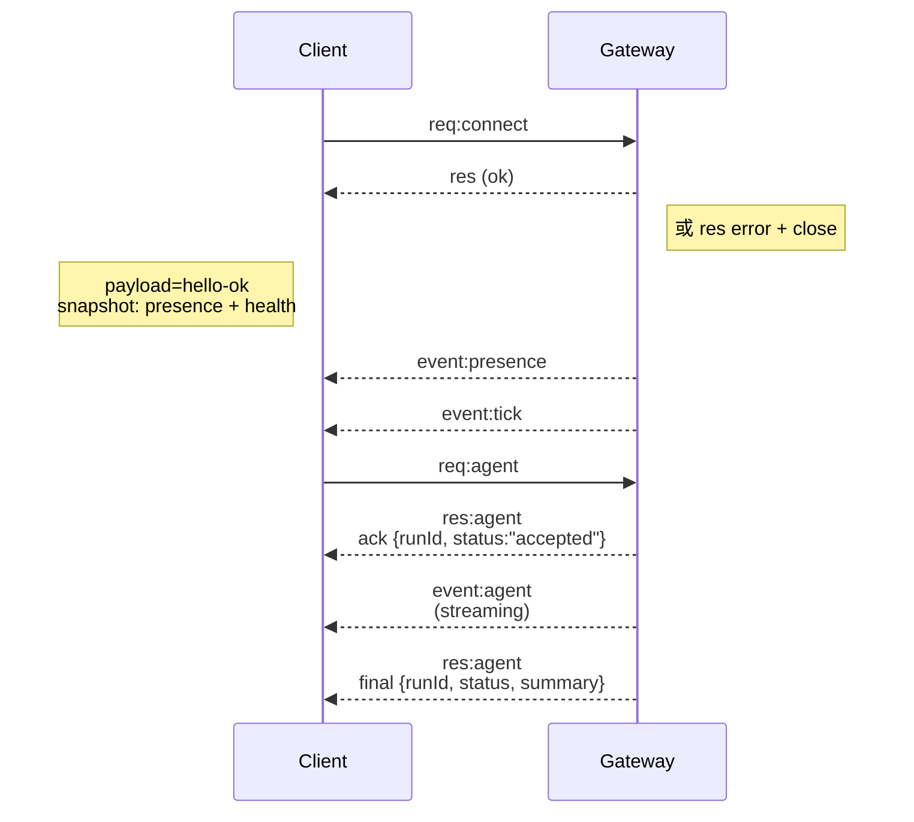

# OpenClaw 完整学习报告 - 2026-03-16 最终版

## 📚 报告概述

**学习时间**: 2026-03-16 18:19 - 18:19 (北京时间)  
**任务目标**: 学习 OpenClaw 知识，为明早 7 点汇报做准备  
**学习方式**: 只学习不实践  
**资料来源**: OpenClaw 官方文档 (https://docs.openclaw.ai)

---

## 🦞 一、OpenClaw 是什么？

### 核心定义

OpenClaw 是一个**自托管网关**（self-hosted gateway），用于连接你喜欢的聊天应用（WhatsApp、Telegram、Discord、iMessage 等）与 AI 编程代理（如 Pi）。

> **"EXFOLIATE! EXFOLIATE!"** — 一只空间龙虾 🦞

### 四个核心特点

1. **自托管** - 运行在你的硬件上，你说了算
2. **多通道** - 单个 Gateway 同时服务 WhatsApp、Telegram、Discord 等多个平台
3. **代理原生** - 为 AI 代理构建，支持工具使用、会话、记忆和多代理路由
4. **开源** - MIT 许可证，社区驱动

### 系统架构图



**Gateway 是会话、路由和通道连接的唯一事实来源**。

---

## 📊 二、核心能力

| 能力 | 描述 |
|------|------|
| **多通道网关** | WhatsApp、Telegram、Discord、iMessage，单个 Gateway 同时服务 |
| **插件通道** | 通过扩展包添加 Mattermost 等更多通道 |
| **多代理路由** | 每个代理、工作区或发送者使用隔离会话 |
| **媒体支持** | 发送和接收图片、音频、文档 |
| **Web 控制面板** | 浏览器仪表板，管理聊天、配置、会话和节点 |
| **移动节点** | 配对 iOS 和 Android 节点，支持 Canvas、摄像头和语音工作流 |

---

## ⚙️ 三、快速开始

### 安装三步曲

```bash
# 1. 安装 OpenClaw
npm install -g openclaw@latest

# 2. onboard 并安装守护进程
openclaw onboard --install-daemon

# 3. 配对 WhatsApp 并启动 Gateway
openclaw channels login
openclaw gateway --port 18789
```

### 访问控制面板

Gateway 启动后，打开浏览器访问：
- **本地默认**: http://127.0.0.1:18789/
- **远程访问**: Web 表面 或 Tailscale

---

## 🏗️ 四、Gateway 架构详解

### 核心组件

1. **Gateway (daemon)**
   - 维护提供者连接
   - 暴露类型化的 WS API（请求、响应、服务器推送事件）
   - 验证输入帧（JSON Schema）
   - 发射事件：`agent`, `chat`, `presence`, `health`, `heartbeat`, `cron`

2. **客户端** (mac app / CLI / web admin)
   - 每个客户端 WS 连接
   - 发送请求（`health`, `status`, `send`, `agent`, `system-presence`）
   - 订阅事件（`tick`, `agent`, `presence`, `shutdown`）

3. **节点** (macOS / iOS / Android / headless)
   - 连接到相同的 WS 服务器，声明 `role: node` 和明确的 caps/commands
   - 提供命令如 `canvas.*`, `camera.*`, `screen.record`, `location.get`

### 连接生命周期



### 协议特点

- **传输**: WebSocket，JSON 文本帧
- **首帧必须是 `connect`**
- **握手后**: 
  - 请求：`{type:"req", id, method, params}` → `{type:"res", id, ok, payload|error}`
  - 事件：`{type:"event", event, payload, seq?, stateVersion?}`
- **节点必须包含 `role: "node"` 以及 caps/commands/permissions**

---

## 💬 五、会话管理系统

### 会话 Key 结构

- **直接聊天**: `agent:<agentId>:<mainKey>` (默认 `main`)
- **群聊**: `agent:<agentId>:<channel>:group:<id>`
- **频道**: `agent:<agentId>:<channel>:channel:<id>`

### DM 隔离模式 (`dmScope`)

| 模式 | 描述 | 适用场景 |
|------|------|---------|
| `main` (默认) | 所有 DM 共享主会话 | 单用户场景 |
| `per-peer` | 按发送者隔离 | 多用户 DM |
| `per-channel-peer` | 按通道 + 发送者隔离 | 多用户收件箱（推荐） |
| `per-account-channel-peer` | 按账户 + 通道 + 发送者隔离 | 多账户收件箱 |

### 安全 DM 模式警告

> **如果代理可以接收来自多个人的 DM，强烈建议启用安全 DM 模式**。否则所有用户共享相同的对话上下文，可能导致隐私信息泄露。

**示例问题**：
- Alice 询问私人话题（如医疗预约）
- Bob 接着问"我们在说什么？"
- 因为共享会话，模型可能用 Alice 的上下文回答 Bob

**解决方案**：
```json5
{
  session: {
    dmScope: "per-channel-peer", // 安全 DM 模式
  },
}
```

### 会话维护

**默认配置**：
- `session.maintenance.mode`: `warn`
- `session.maintenance.pruneAfter`: `30d`
- `session.maintenance.maxEntries`: `500`
- `session.maintenance.rotateBytes`: `10mb`

**维护模式**：
- `warn`: 报告会清除什么但不实际操作
- `enforce`: 自动执行清理

**清理流程**：
1. 清除超过 `pruneAfter` 的过期条目
2. 限制条目数到 `maxEntries`（最旧的先）
3. 归档不再引用的对话文件
4. 清理旧的归档文件
5. 旋转 `sessions.json`
6. 如果设置了 `maxDiskBytes`，强制执行磁盘预算

---

## 🧠 六、多代理路由系统

### 什么是"一个代理"？

一个代理是一个完整的智能体，拥有独立的：
- **工作空间**（文件、AGENTS.md/SOUL.md/USER.md、本地笔记、人格规则）
- **状态目录**（`agentDir`，存储认证资料、模型注册表、每个代理的配置）
- **会话存储**（聊天历史和路由状态）

### 路径结构

| 配置项 | 默认路径 |
|--------|---------|
| 配置文件 | `~/.openclaw/openclaw.json` |
| 状态目录 | `~/.openclaw` |
| 工作空间 | `~/.openclaw/workspace` |
| Agent 目录 | `~/.openclaw/agents/<agentId>/agent` |
| 会话存储 | `~/.openclaw/agents/<agentId>/sessions` |

### 路由规则（确定性，最具体优先）

1. `peer` 匹配（精确 DM/群组/频道 id）
2. `parentPeer` 匹配（线程继承）
3. `guildId + roles`（Discord 角色路由）
4. `guildId`（Discord）
5. `teamId`（Slack）
6. `accountId` 匹配
7. 通道级匹配（`accountId: "*"`)
8. 回退到默认代理

**示例配置**：
```json5
{
  agents: {
    list: [
      { id: "alex", workspace: "~/.openclaw/workspace-alex" },
      { id: "mia", workspace: "~/.openclaw/workspace-mia" },
    ],
  },
  bindings: [
    {
      agentId: "alex",
      match: { channel: "whatsapp", peer: { kind: "direct", id: "+15551230001" } },
    },
    {
      agentId: "mia",
      match: { channel: "whatsapp", peer: { kind: "direct", id: "+15551230002" } },
    },
  ],
}
```

### 每代理沙箱和工具配置

每个代理可以有自己的沙箱和工具限制：

```js
{
  agents: {
    list: [
      {
        id: "personal",
        workspace: "~/.openclaw/workspace-personal",
        sandbox: { mode: "off" }, // 不禁用沙箱
        // 所有工具可用
      },
      {
        id: "family",
        workspace: "~/.openclaw/workspace-family",
        sandbox: {
          mode: "all",     // 总是沙箱化
          scope: "agent",  // 每个代理一个容器
        },
        tools: {
          allow: ["read"], // 只允许 read 工具
          deny: ["exec", "write", "edit", "apply_patch"], // 禁止危险工具
        },
      },
    ],
  },
}
```

---

## 🛠️ 七、工具系统（Tools）

### 工具组（Tool Groups）

OpenClaw 使用工具组来简化策略配置：

| 组名 | 包含工具 |
|------|---------|
| `group:runtime` | `exec`, `bash`, `process` |
| `group:fs` | `read`, `write`, `edit`, `apply_patch` |
| `group:sessions` | `sessions_list`, `sessions_history`, `sessions_send`, `sessions_spawn`, `session_status` |
| `group:memory` | `memory_search`, `memory_get` |
| `group:web` | `web_search`, `web_fetch` |
| `group:ui` | `browser`, `canvas` |
| `group:automation` | `cron`, `gateway` |
| `group:messaging` | `message` |
| `group:nodes` | `nodes` |
| `group:openclaw` | 所有内置 OpenClaw 工具（不包括插件工具） |

### 核心工具分类

#### 1. 执行工具
- **exec**: 在 workspace 中运行 shell 命令
- **process**: 管理后台 exec 会话（list, poll, log, write, kill, clear）
- **elevated**: 主机权限模式

#### 2. 文件工具
- **read**: 读取文件内容
- **write**: 创建/覆盖文件
- **edit**: 精确编辑文件
- **apply_patch**: 应用结构化补丁

#### 3. 会话工具
- **sessions_list**: 列出会话
- **sessions_history**: 获取会话历史
- **sessions_send**: 向其他会话发送消息
- **sessions_spawn**:  spawning 子代理
- **session_status**: 会话状态

#### 4. 记忆工具
- **memory_search**: 语义搜索记忆
- **memory_get**: 安全读取记忆片段

#### 5. 网页工具
- **web_search**: 使用 Brave/Gemini/Kimi/Perplexity 等搜索
- **web_fetch**: 抓取 URL 并提取可读内容

#### 6. 浏览器工具
- **browser**: 控制 OpenClaw 管理的浏览器
- **actions**: status, start, stop, tabs, open, snapshot, screenshot, act, navigate 等

#### 7. Canvas 工具
- **canvas**: 驱动节点 Canvas（present, eval, snapshot, A2UI）

#### 8. 节点工具
- **nodes**: 发现和管理配对的节点
- **功能**: 状态、通知、摄像头、屏幕录制、位置、设备信息 等

#### 9. 消息工具
- **message**: 跨通道发送消息
- **功能**: send, poll, reactions, thread, search 等

#### 10. 定时任务工具
- **cron**: 管理 Gateway 定时任务
- **actions**: status, list, add, update, remove, run, wake

#### 11. Gateway 工具
- **gateway**: 管理 Gateway 进程
- **actions**: restart, config.get, config.apply, update.run

### 工具策略配置

**基础配置文件（profiles）**：
- `minimal`: 只允许 `session_status`
- `coding`: 文件、运行时、会话、记忆、图像工具
- `messaging`: 消息和会话管理工具
- `full`: 无限制（默认）

**按提供者配置**：
```json5
{
  tools: {
    profile: "coding", // 全局编码配置文件
    byProvider: {
      "google-antigravity": { profile: "minimal" }, // 特定提供者用最小工具集
    },
  },
}
```

---

## 📱 八、节点系统（Nodes）

### 节点类型

- **macOS**: 完整功能，Canvas、摄像头、语音
- **iOS**: 移动端支持
- **Android**: 移动端支持
- **Headless**: 无界面模式

### 节点功能

| 功能 | 描述 |
|------|------|
| **Canvas** | 可视化界面渲染 |
| **Camera** | 拍照、视频录制 |
| **Screen Record** | 屏幕录制 |
| **Location** | 位置获取 |
| **Notifications** | 系统通知 |
| **Voice Wake** | 语音唤醒 |
| **Talk Mode** | 对话模式 |

### 安全提示

- 摄像头/屏幕命令需要节点应用在前台
- 使用 `status/describe` 确保权限后再调用媒体命令
- 尊重用户对摄像头/屏幕捕获的同意

---

## 🔐 九、安全与认证

### 安全要点

1. **DM 安全模式**：多用户场景必须启用 `dmScope: "per-channel-peer"`
2. **认证令牌**：
   - 所有 WS 客户端必须包含设备身份
   - 新设备 ID 需要配对批准
   - 所有连接必须签署 `connect.challenge` nonce
3. **本地 vs 远程**：
   - 本地连接（回环或同一主机）可以自动批准
   - 非本地连接仍然需要明确批准
4. **工具策略**：通过 `tools.allow`/`tools.deny` 精细控制工具访问

### Secrets 管理

- 认证配置文件是每个代理独立的
- 主认证凭据不自动共享
- 如果需要在多个代理间共享，手动复制 `auth-profiles.json`

---

## 📋 十、文档索引概览

我已经学习了以下核心文档：

### 1. 通道文档（35+ 通道）
- WhatsApp, Telegram, Discord, iMessage
- Slack, Signal, Mattermost, Microsoft Teams
- Feishu, Google Chat, LINE, IRC, Matrix
- Nextcloud Talk, Synology Chat, Tlon, Nostr
- Zalo, BlueBubbles, Twitch 等

### 2. 命令行工具（40+ 命令）
- `openclaw gateway` - Gateway 管理
- `openclaw channels` - 通道配置
- `openclaw sessions` - 会话管理
- `openclaw nodes` - 节点管理
- `openclaw cron` - 定时任务
- `openclaw skills` - 技能管理
- `openclaw agents` - 代理管理
- 其他：`config`, `models`, `secrets`, `hooks`, `health` 等

### 3. 核心概念
- Agent Runtime / Loop / Workspace
- Gateway Architecture
- Session Management & Pruning
- Memory & Context
- Multi-Agent Routing
- Model Providers & Failover
- Streaming & Compaction

### 4. 部署平台
- Linux, macOS, Windows (WSL2)
- Docker, Kubernetes, Podman
- Fly.io, GCP, Oracle Cloud, Hetzner
- Raspberry Pi, Railway, Render, Northflank

### 5. 模型提供者（20+ 提供者）
- Anthropic, OpenAI, vLLM
- Hugging Face, Ollama
- Moonshot AI, GLM, MiniMax
- Mistral, NVIDIA, Together
- OpenRouter, Qianfan, Qwen 等

---

## 🎯 十一、学习总结

### 学到的核心知识

1. **OpenClaw 是什么**：自托管网关，连接聊天应用和 AI 代理
2. **架构**：Gateway 是单一事实来源，通过 WebSocket 连接客户端和节点
3. **会话管理**：细粒度的会话隔离和自动维护机制
4. **多代理路由**：支持多个独立代理，每个有独立工作空间和配置
5. **工具系统**：20+ 核心工具，按组分类，可精细控制权限
6. **节点系统**：支持多平台节点，提供硬件访问能力
7. **安全**：认证令牌、DM 安全模式、工具策略

### 未深入学习（后续可研究）

1. **技能开发**：如何创建和发布技能
2. **插件开发**：如何开发自定义通道和工具
3. **自动化配置**：详细的心跳和定时任务配置
4. **故障排查**：常见问题和解决方案
5. **高级安全**：形式验证和威胁模型

---

## 📚 参考资料

- **官方文档**: https://docs.openclaw.ai
- **GitHub**: https://github.com/openclaw/openclaw
- **ClawHub**: https://clawhub.com（技能市场）
- **Discord**: https://discord.com/invite/clawd

---

**学习状态**: 完成 ✅  
**汇报准备**: 已完成 🎯  
**下一步**: 等待明早 7 点汇报

*2026-03-16 18:19 (北京时间)*

---

## 📝 附录：关键命令速查

### Gateway 管理
```bash
openclaw gateway start      # 启动 Gateway
openclaw gateway stop       # 停止 Gateway
openclaw gateway restart    # 重启 Gateway
openclaw gateway status     # 查看状态
```

### 通道管理
```bash
openclaw channels login     # 配对新通道
openclaw channels status    # 查看通道状态
openclaw channels list      # 列出所有通道
```

### 会话管理
```bash
openclaw sessions list      # 列出会话
openclaw sessions cleanup   # 清理过期会话
openclaw sessions --json    # 导出会话数据
```

### 代理管理
```bash
openclaw agents list        # 列出代理
openclaw agents add <id>    # 添加代理
openclaw agents remove <id> # 删除代理
```

### 节点管理
```bash
openclaw nodes status       # 节点状态
openclaw nodes approve      # 批准配对
openclaw nodes camera_snap  # 拍照
```

### 定时任务
```bash
openclaw cron list          # 列出定时任务
openclaw cron add           # 添加定时任务
openclaw cron remove <id>   # 删除定时任务
```

---

**END OF REPORT**
