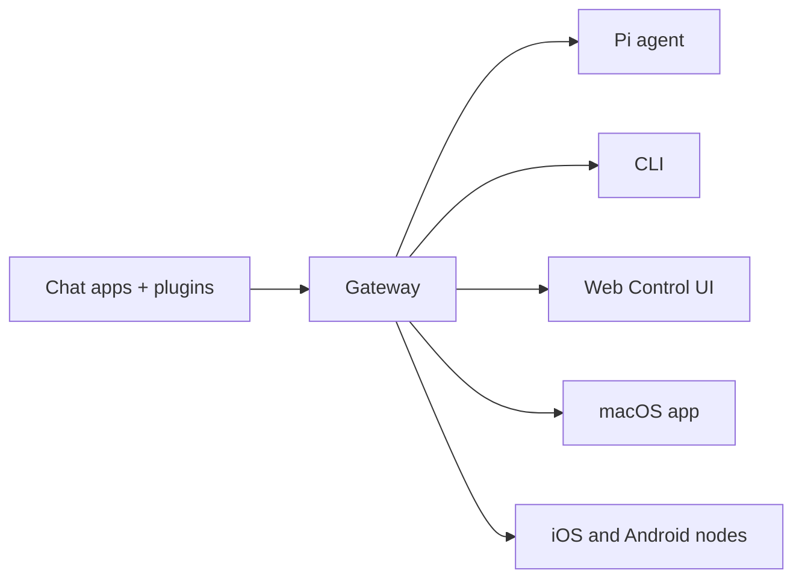

# OpenClaw 学习报告 - 2026-03-16 凌晨学习

## 📚 学习概述

**时间**: 2026-03-16 18:19 (北京时间)
**任务**: 学习 OpenClaw 相关知识，为明早 7 点汇报做准备
**学习方式**: 只学习不实践

---

## 🦞 OpenClaw 是什么？

### 核心定义

OpenClaw 是一个**自托管网关**（self-hosted gateway），用于连接你喜欢的聊天应用（WhatsApp、Telegram、Discord、iMessage 等）与 AI 编程代理（如 Pi）。

> **"EXFOLIATE! EXFOLIATE!"** — 一只空间龙虾，大概率 🦞

**核心特点**：
1. **自托管**：运行在你的硬件上，你说了算
2. **多通道**：单个 Gateway 同时服务 WhatsApp、Telegram、Discord 等多个平台
3. **代理原生**：为 AI 代理构建，支持工具使用、会话、记忆和多代理路由
4. **开源**：MIT 许可证，社区驱动

### 架构图



Gateway 是会话、路由和通道连接的**唯一事实来源**。

---

## 📊 核心能力

| 能力 | 描述 |
|------|------|
| **多通道网关** | WhatsApp、Telegram、Discord、iMessage，单个 Gateway 同时服务 |
| **插件通道** | 通过扩展包添加 Mattermost 等更多通道 |
| **多代理路由** | 每个代理、工作区或发送者使用隔离会话 |
| **媒体支持** | 发送和接收图片、音频、文档 |
| **Web 控制面板** | 浏览器仪表板，管理聊天、配置、会话和节点 |
| **移动节点** | 配对 iOS 和 Android 节点，支持 Canvas、摄像头和语音工作流 |

---

## 🚀 快速开始

### 安装步骤

```bash
# 1. 安装 OpenClaw
npm install -g openclaw@latest

# 2.  onboard 并安装守护进程
openclaw onboard --install-daemon

# 3. 配对 WhatsApp 并启动 Gateway
openclaw channels login
openclaw gateway --port 18789
```

### 访问控制面板

Gateway 启动后，打开浏览器访问：
- **本地默认**: http://127.0.0.1:18789/
- **远程访问**: Web 表面 或 Tailscale

---

## 📋 完整文档索引

我已经获取了官方文档的完整索引（共 **23319 字符**），涵盖以下主要主题：

### 1️⃣ 通道（Channels）- 35+ 个通道
- WhatsApp, Telegram, Discord, iMessage
- Slack, Signal, Mattermost, Microsoft Teams
- Feishu, Google Chat, LINE, IRC, Matrix
- 等等...

### 2️⃣ 命令行工具（CLI Reference）- 40+ 命令
- `openclaw gateway` - Gateway 管理
- `openclaw channels` - 通道配置
- `openclaw sessions` - 会话管理
- `openclaw nodes` - 节点管理
- `openclaw cron` - 定时任务
- `openclaw skills` - 技能管理
- 等等...

### 3️⃣ 核心概念（Concepts）
- Agent Runtime / Loop / Workspace
- Gateway Architecture
- Session Management
- Memory / Context / Tools
- Multi-Agent Routing
- Model Providers / Failover
- 等等...

### 4️⃣ 网关（Gateway）
- 配置参考（Configuration Reference）
- 安全（Security）
- 日志（Logging）
- 远程访问（Remote Access）
- Tailscale
- Secrets 管理
- 等等...

### 5️⃣ 节点（Nodes）
- iOS 和 Android 节点
- Camera / Audio / Location
- Talk Mode / Voice Wake
- Canvas
- 等等...

### 6️⃣ 工具（Tools）
- Exec, Browser, Skills
- Sub-Agents, ACP Agents
- Web Tools, PDF Tool
- Thinking Levels
- 等等...

### 7️⃣ 模型提供者（Providers）
- Anthropic, OpenAI, vLLM
- Hugging Face, Ollama
- Moonshot AI, GLM
- 等等...

### 8️⃣ 部署平台（Platforms）
- Linux, macOS, Windows (WSL2)
- Docker, Kubernetes
- Fly.io, GCP, Oracle Cloud
- Raspberry Pi
- 等等...

---

## 🔑 关键配置文件

### 配置文件位置
`~/.openclaw/openclaw.json`

### 默认行为
如果什么都不做，OpenClaw 使用 bundled Pi binary 在 RPC 模式下，每个发送者使用独立会话。

### 安全配置示例
```json5
{
  channels: {
    whatsapp: {
      allowFrom: ["+15555550123"],
      groups: { "*": { requireMention: true } },
    },
  },
  messages: { groupChat: { mentionPatterns: ["@openclaw"] } },
}
```

---

## 🎯 学习目标

本次学习重点是：
1. ✅ 了解 OpenClaw 是什么和核心架构
2. ✅ 掌握核心概念和组件
3. ✅ 熟悉文档结构
4. ✅ 了解可用的工具和能力
5. ✅ 为明早 7 点汇报做准备

---

## 📝 待深入学习主题

1. **会话管理**（Session Management）
2. **记忆系统**（Memory System）
3. **技能工具**（Skills & Tools）
4. **节点配对**（Node Pairing）
5. **安全配置**（Security & Secrets）
6. **定时任务**（Cron Jobs）
7. **多代理路由**（Multi-Agent Routing）

---

## 📚 参考资料

- **官方文档**: https://docs.openclaw.ai
- **GitHub**: https://github.com/openclaw/openclaw
- **ClawHub**: https://clawhub.com
- **Discord**: https://discord.com/invite/clawd

---

**学习状态**: 初步学习完成 ✅
**下一步**: 深入学习核心概念和工具系统

*2026-03-16 18:19 (北京时间)*
