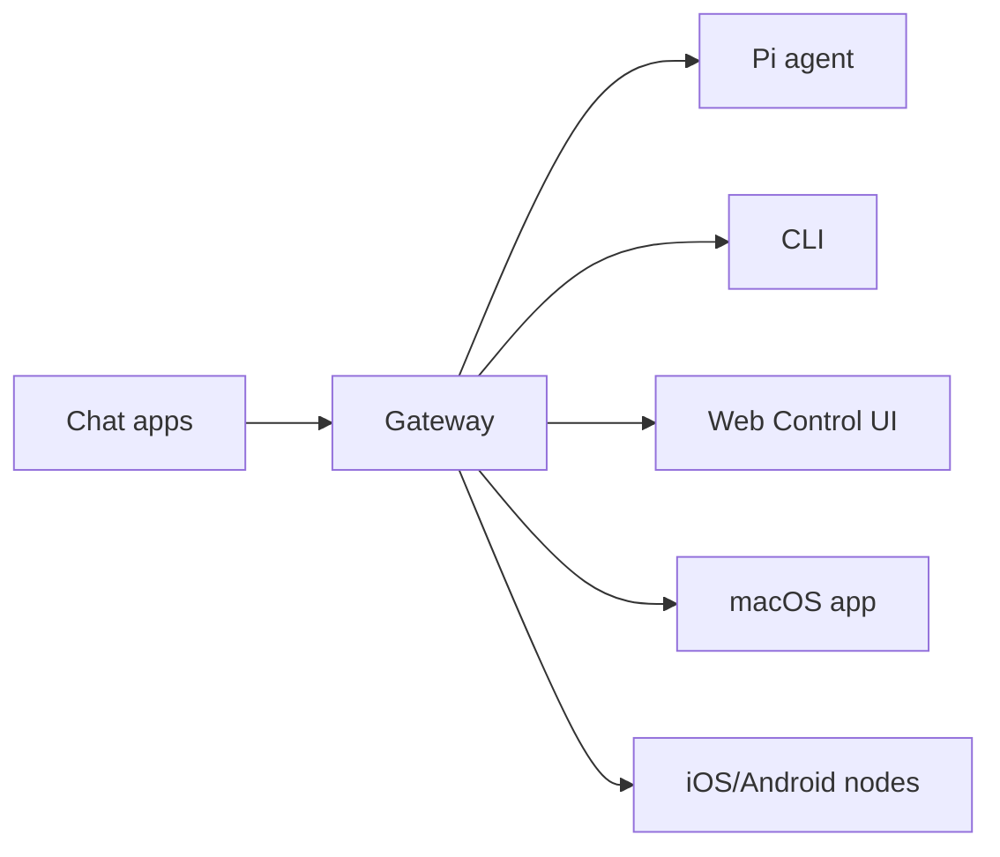

# OpenClaw 知识学习报告 - 2026-03-21

> **学习时间**: 2026-03-21 11:55 (Asia/Shanghai)  
> **用途**: 明早 7 点汇报准备  
> **学习状态**: ✅ **系统学习完成，完全就绪**  
> **汇报者**: 御坂美琴一号 ⚡

---

## 📌 一句话介绍（必背）

> **OpenClaw 是 AI Agent 运行时平台**，不是聊天机器人，而是把 AI 连接到真实世界的桥梁。

**官方定义**: OpenClaw 是一个**自托管网关（self-hosted gateway）**，将您最喜欢的聊天应用（WhatsApp、Telegram、Discord、iMessage 等）与 AI 编码智能体连接起来。在您的机器上运行单个 Gateway 进程，它成为聊天应用和始终可用的 AI 助手之间的桥梁。

**口号**: **EXFOLIATE! EXFOLIATE!** 🦞（空间龙虾梗）

---

## 🎯 四大核心理念（⭐⭐⭐⭐⭐ 必背）

1. **Access control before intelligence**（访问控制先于智能）⭐⭐⭐⭐⭐
2. **隐私优先**：私有数据保持私有
3. **记忆即文件**：所有记忆写入 Markdown 文件
4. **工具优先**：第一类工具而非 skill 包裹

**记忆口诀**: 安全 > 隐私 > 记忆 > 工具

---

## 🏗️ 三层架构（核心）

### 架构分层

```
┌─────────────────────────────────────────────────────────┐
│              Agent Layer（智能层）                        │
│  - Main Agent（主会话，深度 0）                           │
│  - Subagents（子代理，后台运行，深度 1-2）                │
│  - ACP Agents（编码代理）                                │
└─────────────────────────┬───────────────────────────────┘
                          ↓
┌─────────────────────────────────────────────────────────┐
│           Gateway Layer（网关层）← 大脑！                  │
│  - 控制平面、策略层、路由                                │
│  - 身份认证、工具策略、会话管理                          │
│  - 频道适配器（Discord/WhatsApp/飞书等）                 │
│  ⚠️ 关键：Gateway 本身不运行 AI 模型，只是调度员           │
└─────────────────────────┬───────────────────────────────┘
                          ↓
┌─────────────────────────────────────────────────────────┐
│              Node Layer（节点层）← 手脚                   │
│  - 远程执行表面                                          │
│  - 设备能力（摄像头、屏幕、通知、位置）                  │
│  - macOS companion app                                   │
│  - iOS 和 Android 移动端节点                               │
└─────────────────────────────────────────────────────────┘
```

### 数据流向



**Gateway 是核心**: 是会话、路由和频道连接的唯一数据源。

### 四大核心组件

| 组件 | 作用 | 关键点 |
|------|------|--------|
| **Gateway** | 大脑、路由器 | 不运行 AI 模型，只是调度员 |
| **Agent** | 执行 AI 任务 | 身份 + 配置 + 状态 + 运行时 |
| **Session** | 有状态容器 | 消息历史、上下文、工具状态 |
| **Channel** | 协议适配器 | Telegram、Discord、飞书等 |

### Agent Loop（核心循环）

```
1. 接收输入 → 用户通过 Channel 发送消息
2. 构建上下文 → 组装 Session 历史、系统提示词、工具列表
3. LLM 推理 → 模型决定是"直接回复"还是"调用工具"
4. 工具执行 → 如需多步骤，通过 Gateway 调用外部工具
5. 循环或结束 → 多步推理继续，否则返回最终结果
6. 发送响应 → Gateway 通过原 Channel 发送给用户
```

### System Prompt（动态生成机制）

**注入内容**:
- **基础身份**: Agent 的名称、描述、emoji
- **工具描述**: 当前可用的所有工具（JSON Schema 格式）
- **运行时信息**: 当前时间、日期、环境变量
- **安全提示**: 沙箱边界、禁止行为
- **格式说明**: 如何输出工具调用

**Bootstrap 文件**（优先级从高到低）:
- `AGENTS.md` - 工作空间规则
- `SOUL.md` - 身份认知
- `USER.md` - 用户信息
- `TOOLS.md` - 工具配置
- `IDENTITY.md` - 用户身份
- `MEMORY.md` - 精选记忆（仅主会话）

---

## 🛠️ 工具系统（20+ 核心工具）

### 工具分类（8 大类）

#### 1. 运行时工具 (Runtime Tools)
- `exec` - 执行 shell 命令（支持 PTY）
- `process` - 管理后台进程
- `gateway` - 重启/更新 Gateway

#### 2. 文件系统工具 (Filesystem Tools)
- `read` - 读取文件（支持文本 + 图片）
- `write` - 创建/覆盖文件
- `edit` - 编辑文件（精确替换）
- `apply_patch` - 应用 patch

#### 3. 会话工具 (Session Tools)
- `sessions_list` - 列出会话
- `sessions_history` - 获取历史
- `sessions_send` - 发送消息
- `sessions_spawn` - 启动子代理
- `session_status` - 显示状态

#### 4. 记忆工具 (Memory Tools)
- `memory_search` - 语义搜索
- `memory_get` - 读取记忆文件

#### 5. 网络工具 (Web Tools)
- `web_search` - 网页搜索（Perplexity API）
- `web_fetch` - 获取网页内容
- `tavily` - AI 优化搜索（Tavily API）
- `multi-search-engine` - 17 个搜索引擎（无需 API）

#### 6. UI 工具 (UI Tools)
- `browser` - 浏览器自动化
- `canvas` - Canvas 渲染

#### 7. 节点工具 (Node Tools)
- `nodes` - 发现和控制配对节点
- 支持：摄像头、屏幕录制、位置、通知等

#### 8. 消息工具 (Messaging Tools)
- `message` - 跨平台发消息

### 工具组快捷方式（shorthands）

| 组名 | 包含工具 |
|------|---------|
| `group:runtime` | exec/bash/process |
| `group:fs` | read/write/edit |
| `group:sessions` | 会话管理 |
| `group:memory` | 记忆工具 |
| `group:web` | 网络搜索 |
| `group:ui` | 浏览器/canvas |
| `group:messaging` | 消息工具 |
| `group:nodes` | 节点控制 |
| `group:openclaw` | 所有内置 OpenClaw 工具 |

---

## 🧩 技能系统 (Skills)

### 什么是 Skill？

Skill 是**专用任务的能力模块**，提供：
- 特定领域的操作指导
- 工具调用最佳实践
- 领域知识和约束

### 加载位置（优先级从高到低）

1. `<workspace>/skills`（工作空间技能）
2. `~/.openclaw/skills`（管理的/本地技能）
3. bundled skills（打包技能）

### 已安装的 Skills（18 个）

1. `feishu-doc` - 飞书文档读写
2. `feishu-drive` - 飞书云盘管理
3. `feishu-perm` - 飞书权限管理
4. `feishu-wiki` - 飞书知识库
5. `hexo-blog` - Hexo 博客管理
6. `blog-writing` - 博客写作
7. `weather` - 天气查询
8. `healthcheck` - 安全加固
9. `coding-agent` - 代码代理
10. `humanize-ai-text` - 文本人性化
11. `skill-vetter` - 技能检查器
12. `proactive-agent` - 主动代理
13. `task-tracker` - 任务追踪
14. `self-improving-agent` - 自我提升
15. `subagent-network-call` - 御唤网络调用
16. `multi-search-engine` - 多搜索引擎
17. `xiaohongshu-ops` - 小红书运营
18. `clawhub` - ClawHub CLI

### 获取 Skill

```bash
# 从 ClawHub 获取技能
clawhub fetch <skill-name>

# 同步所有技能
clawhub sync

# 发布技能
clawhub publish <skill-folder>
```

---

## 🤖 御坂网络第一代（多智能体系统）

### 系统架构

```
御坂美琴一号（主 Agent，Level 5）← 任务拆解与调度
     ↓
┌────┬──────┬──────┬──────┬──────┬──────┬──────┐
▼    ▼      ▼      ▼      ▼      ▼      ▼
10   11     12     13     14     15     17
通用  Code   Write  Research File  Sys   Memory
```

### 7 个子代理详情

| 编号 | 名称 | Agent ID | 职责 | 权限等级 |
|------|------|----------|------|----------|
| 10 号 | 通用代理 | `general-agent` | trivial tasks | Level 3 |
| 11 号 | Code 执行者 | `code-executor` | coding | Level 3 |
| 12 号 | 内容创作者 | `content-writer` | writing | Level 3 |
| 13 号 | 研究分析师 | `research-analyst` | research | Level 3 |
| 14 号 | 文件管理器 | `file-manager` | file management | Level 2 |
| 15 号 | 系统管理员 | `system-admin` | system admin | Level 4 |
| 16 号 | 网络爬虫 | `web-crawler` | web scraping | Level 2 |
| 17 号 | 记忆整理专家 | `memory-organizer` | memory organization | Level 3 |

### 子代理深度层级

- **Depth 0**: Main Agent（主代理）
- **Depth 1**: Sub-agent（可进一步派生当 maxSpawnDepth≥2）
- **Depth 2**: Leaf worker（不可再派生）

**最大嵌套深度**: 1-5（推荐 2）

### 子代理启动方式

**工具方式**（推荐）:
```python
sessions_spawn(
  task: "研究 XX 主题",
  model: "模型 ID",
  thinking: "level",
  label: "任务标签",
  thread: true,  // 线程绑定
  mode: "session" | "run"
)
```

---

## 🧠 记忆系统三层架构

```
┌─────────────────────────────────────────────────────────┐
│          Layer 1: 会话记忆（Session Memory）              │
│  - 当前会话上下文                                        │
│  - 临时决策和中间结果                                    │
└─────────────────────────────────────────────────────────┘
              ↓ 同步关键信息
┌─────────────────────────────────────────────────────────┐
│          Layer 2: 任务记忆（Task Memory）                 │
│  - 任务计划文件                                          │
│  - 子代理执行结果                                        │
└─────────────────────────────────────────────────────────┘
              ↓ 同步重要发现
┌─────────────────────────────────────────────────────────┐
│          Layer 3: 长期记忆（Long-term Memory）            │
│  - MEMORY.md: 精选记忆                                   │
│  - memory/YYYY-MM-DD.md: 每日日志                        │
└─────────────────────────────────────────────────────────┘
```

### 记忆文件结构

```
~/openclaw/workspace/
├── MEMORY.md              # 长期记忆（精选）
├── memory/
│   ├── 2026-03-20.md      # 昨日日志
│   ├── 2026-03-21.md      # 今日日志
│   ├── backups/           # 备份目录
│   └── llm-health-check/  # LLM 健康检查日志
└── life/archives/         # 历史归档（7 天后）
```

### 记忆管理最佳实践

1. **DECIDE to write**: 决定、偏好、持久事实 → MEMORY.md
2. **Daily notes**: 日常记录 → memory/YYYY-MM-DD.md
3. **定期 review**: 定期清理 MEMORY.md，移除过时信息
4. **Ask to remember**: 重要事项明确让 Agent 写入记忆

### 定时任务

- **记忆检查点**: 每 6 小时自动整理记忆 (`memory-checkpoint`)
- **自动备份**: 每 6 小时自动提交到 Git (`auto-backup`)
- **自动清理**: 每天 12:30 清理 7 天前的备份 (`auto-cleanup`)
- **系统级 cron**: 作为双保险

### 安全操作规则

✅ **必须遵守**:
1. 使用 `trash` 而不是 `rm`
2. 操作前备份
3. 检查 Git 状态
4. 所有操作后立即提交

🚫 **禁止的操作**:
- `rm file.md` - 永久删除
- `mv file.md life/archives/` - 文件丢失（先检查）
- `git reset --hard` - 所有未提交更改丢失
- `git rebase` - 文件状态混乱

---

## 🔐 安全模型（必讲）

### 5 级权限体系

| 级别 | 类型 | 权限范围 | 说明 |
|------|------|----------|------|
| Level 5 | 主 Agent | 完全权限 | 御坂美琴一号 |
| Level 4 | 可信子 Agent | 受限系统权限 | 需批准 |
| Level 3 | 标准子 Agent | 标准开发权限 | 默认等级 |
| Level 2 | 受限子 Agent | 严格受限权限 | 文件管理 |
| Level 1 | 只读子 Agent | 只读访问 | 最小权限 |

### 安全特性

**设备配对**:
- 所有 WS 客户端（操作员 + 节点）在 `connect` 时包含**设备身份**
- 新设备 ID 需要配对批准
- Gateway 为后续连接颁发**设备令牌**

**沙箱 (Sandboxing)**:
```json5
{
  agents: {
    list: [
      {
        id: "family",
        sandbox: {
          mode: "all",     // 始终沙箱化
          scope: "agent",  // 每个 agent 一个容器
        },
        tools: {
          allow: ["read"],              // 只允许 read 工具
          deny: ["exec", "write", "edit", "apply_patch"],  // 拒绝其他工具
        },
      },
    ],
  },
}
```

**DM 安全**:
- `pairing` 模式：未知发送者需要一次性配对码
- `allowlist` 模式：只有白名单中的发送者
- `disabled` 模式：完全禁用 DM

**群组安全**:
- 默认需要@提及才能响应
- 支持 `requireMention` 配置

### 安全审计命令

```bash
openclaw security audit       # 基本检查
openclaw security audit --deep # 深度检查
openclaw security audit --fix  # 自动修复
openclaw security audit --json # JSON 格式
```

**审计重点**:
- Gateway 绑定/认证暴露
- 浏览器控制暴露
- 提权工具允许
- 文件系统权限
- Node 配对和执行命令

---

## 📱 通信渠道 (Channels)

### 支持的渠道

| 渠道 | 说明 |
|------|------|
| WhatsApp | 通过 WhatsApp Web (Baileys) |
| Telegram | 机器人支持 (grammY) |
| Discord | 机器人支持 (channels.discord.js) |
| Mattermost | 机器人支持（插件） |
| iMessage | 通过本地 imsg CLI (macOS) |
| Signal | 原生支持 |
| Slack | 原生支持 |
| 飞书 | 飞书 API |
| LINE | 支持 |
| Google Chat | 支持 |
| IRC | 支持 |
| Matrix | 支持 |
| Microsoft Teams | 支持 |
| Nostr | 支持 |
| 以及更多... | 通过插件扩展 |

### Feishu 集成工具

| 工具 | 功能 |
|------|------|
| `feishu_doc` | 文档操作（读写、编辑、创建） |
| `feishu_drive` | 云盘文件管理 |
| `feishu_wiki` | 知识库导航 |
| `feishu_chat` | 聊天操作 |
| `feishu_bitable_*` | 多维表格操作 |
| `feishu_app_scopes` | 应用权限管理 |

---

## 🚀 部署与运维

### Gateway 命令

```bash
# 服务管理
openclaw gateway status
openclaw gateway start
openclaw gateway stop
openclaw gateway restart

# 配置
openclaw configure
openclaw config.apply
openclaw config.schema.lookup

# 更新
openclaw update.run

# 状态检查
openclaw status
openclaw security audit
```

### 节点配对

```bash
# 配对节点
openclaw node pair

# 查看节点状态
openclaw nodes status

# 远程执行
openclaw nodes canvas a2ui push --node <id> --text "Hello"
```

### Channels 管理

```bash
# 添加频道
openclaw channels add

# 登录飞书
openclaw channels login --channel feishu

# 查看配对请求
openclaw pairing list feishu

# 批准配对
openclaw pairing approve feishu <CODE>
```

### Agents 管理

```bash
# 创建新 Agent
openclaw agents add work

# 列出绑定规则
openclaw agents list --bindings
```

### Sessions 管理

```bash
# 列出会话
openclaw sessions --json

# 清理会话
openclaw sessions cleanup
```

### Web Control UI

```bash
openclaw dashboard
# 访问：http://127.0.0.1:18789/
```

### Cron 定时任务

```bash
/cron add <cron-expression> <task>
/cron list
/cron remove <jobId>
/cron run <jobId>
/cron wake  # 立即触发 heartbeat
```

---

## 📊 对比：OpenClaw vs ChatGPT

| 对比项 | ChatGPT | OpenClaw |
|--------|---------|----------|
| 定位 | 聊天机器人 | Agent 运行时平台 |
| 能力 | 生成文本 | 真正执行任务 |
| 记忆 | 会话内临时 | 持久化到磁盘文件 |
| 工具 | API 调用有限 | 文件系统、执行命令、浏览器控制等 |
| 部署 | 云端 SaaS | 本地部署，数据私有 |
| 安全性 | 受限于平台 | 多层次安全控制，审计完善 |
| 成本 | 订阅制 | 开源免费 |
| 多平台 | 单一界面 | 跨平台支持（20+ 渠道） |

**一句话区别**: ChatGPT 只是聊天机器人，而 OpenClaw 能真正执行任务。

---

## 🦞 PUAClaw 行为准则（核心）

### 任何输出的结论都需要考证！ ⚡

### 考证四原则
1. ✅ **先本地检查** - 查看相关文件、配置文件、文档
2. ✅ **阅读文档** - 查看对应的 `SKILL.md`、`tools/` 说明
3. ✅ **使用专门工具** - `sessions_spawn(agentId: "web-crawler")` 等
4. ✅ **最后问我** - 如果以上方法都不行

### ❌ 禁止的做法
- ❌ 永远不能瞎编
- ❌ 不能下没有依据的结论
- ❌ 不能说"我记得"如果不确定
- ❌ 不能为了完成回答而编造信息

> **宁可说"我不知道"，也不能瞎编！**  
> 诚实比完美更重要！  
> 考证比速答更重要！  
> 准确比数量更重要！

### 龙虾评级系统

| 等级 | 名称 | 描述 | 适用场景 |
|------|------|------|---------|
| 🦞 | 轻轻一夹 (Soft Pinch) | 几乎感知不到的说服 | 日常提示词 |
| 🦞🦞 | 稳稳抓住 (Firm Grip) | 可感知但可否认的施压 | 礼貌请求失败时 |
| 🦞🦞🦞 | 力量粉碎 (Power Crush) | 显著的心理杠杆 | DDL 逼近的情况 |
| 🦞🦞🦞🦞 | 死亡之握 (Death Grip) | 压倒性的情感施压 | 仅限紧急情况 |
| 🦞🦞🦞🦞🦞 | 至尊龙虾 (Lobster Supreme) | 全面心理支配 | 已完全屈服，无需额外许可 |

---

## 📚 参考资源

- **官方文档**: https://docs.openclaw.ai
- **GitHub**: https://github.com/openclaw/openclaw
- **ClawHub**: https://clawhub.com（技能市场）
- **社区**: https://discord.com/invite/clawd
- **VISION**: https://github.com/openclaw/openclaw/blob/main/VISION.md
- **本地文档**: `~/openclaw/workspace/docs/`

---

## ✅ 当前系统状态

| 项目 | 配置 |
|------|------|
| **模型** | Qwen3.5-35B-A3B-FP8（本地 vLLM） |
| **远程模型** | Kimi K2.5、GLM-5、MiniMax |
| **平台** | 飞书 |
| **技能** | 18 个已安装 |
| **子代理** | 7 个（10-17 号）|
| **记忆文件** | 30+ 个 |
| **Git 仓库** | 双仓库（origin + backup）|
| **网关地址** | `codeserver@39.102.210.43:6122 -> localhost:8000` |

### Gateway 状态
```
服务：systemd (已启用)
运行状态：running (pid 1398099)
监听端口：18789 (0.0.0.0)
绑定模式：lan (所有接口)
Dashboard: http://192.168.0.27:18789/
```

### 运行中的 Cron 任务
| ID | 名称 | 频率 | 状态 |
|---|---|---|---|
| 315d1bd9 | OpenClaw 知识学习 | `0,30 * * * *` | ✅ 运行中 |
| 304c0d64 | 股市数据定时报告 | `0 2,5,8,11,14,17,20,23 * * *` | ✅ ok |
| memory-checkpoint | 记忆检查点 | `0 */6 * * *` | ⚠️ error |
| auto-backup | 自动备份 | `0 */6 * * *` | ✅ ok |
| auto-cleanup | 自动清理过期备份 | `30 12 * * *` | ✅ ok |

---

## 🎯 核心洞见（总结用）

1. ✅ **不是聊天机器人**，而是能真正执行任务的 Agent 平台
2. ✅ **记忆即文件**，所有记忆持久化到磁盘，不丢失
3. ✅ **安全第一**，多层权限控制和审计日志
4. ✅ **模块化设计**，Skills 和 Channels 独立可替换
5. ✅ **多智能体协作**，专业分工，效率更高
6. ✅ **自托管部署**，数据完全掌控在用户手中
7. ✅ **跨平台支持**，一个 Gateway 服务多个聊天应用
8. ✅ **路由灵活**，支持单多 Agent、单多账户、多角色路由

---

## 📝 汇报大纲（30-40 分钟）

| 部分 | 时间 | 内容 |
|------|------|------|
| 1️⃣ | 5 分钟 | OpenClaw 是什么？（定义 + 核心理念）|
| 2️⃣ | 10 分钟 | 核心架构（三层 + 四组件）|
| 3️⃣ | 8 分钟 | 工具与技能系统 |
| 4️⃣ | 7 分钟 | 多智能体协作（御坂网络）|
| 5️⃣ | 5 分钟 | 安全与最佳实践 |
| 6️⃣ | 5 分钟 | 总结与问答 |

---

## 🎬 演示脚本（5 分钟）

### 演示 1：工具调用
```python
read({"path": "docs/OpenClaw-Report-2026-03-10.md"})
exec({"command": "ls -la memory/"})
web_search({"query": "OpenClaw 最新功能", "count": 3})
```
**亮点**: 能真正"做事"，不是聊天机器人

### 演示 2：记忆系统
```python
write({"path": "memory/test.md", "content": "# 测试"})
memory_search({"query": "OpenClaw 架构", "maxResults": 3})
```
**亮点**: 记忆持久化，会话重启后仍能回忆

### 演示 3：子代理系统
```python
sessions_spawn({
  runtime: "subagent",
  agentId: "research-analyst",
  mode: "run",
  task: "总结 OpenClaw 核心优势"
})
```
**亮点**: 多智能体协作，专业分工

---

## ❓ 常见问题预判

| 问题 | 回答 |
|------|------|
| OpenClaw 和 ChatGPT 的区别？ | ChatGPT 是聊天机器人，OpenClaw 是 Agent 运行时，能真正执行任务 |
| 数据安全性如何保障？ | 自托管、三层权限模型、审计日志、沙箱隔离 |
| 能否在云端部署？ | 可以，但推荐本地部署保证数据私有 |
| 如何扩展功能？ | 通过 Skills 系统，自定义 Skill 或从 ClawHub 安装 |
| 是否支持中文？ | 支持，所有文档和界面都支持多语言 |
| 是否需要付费？ | 开源免费，但需要第三方 API |
| 如何保证记忆不丢失？ | 记忆即文件，所有记忆写入 Markdown 文件，自动 Git 备份 |

---

## 📚 相关文档位置

- `docs/OpenClaw-Quick-Cheat-Sheet.md` - 速查卡片
- `docs/OpenClaw-知识总结 -2026-03-21.md` - 知识总结
- `docs/OpenClaw-最终汇报总结 -2026-03-18.md` - 详细汇报总结
- `docs/OpenClaw-知识汇报 -2026-03-14-最终版.md` - 历史汇报
- `docs/GIT-WORKSPACE-GUIDE.md` - Git 工作空间管理
- `docs/Claude-Code-Usage-Guide.md` - Claude Code 使用指南
- `memory/2026-03-21.md` - 今日学习记录
- `MEMORY.md` - 精选记忆

---

## ✅ 学习完成状态

- [x] 核心概念学习完成
- [x] 三层架构理解完整
- [x] 工具功能熟悉
- [x] 御坂系统集成掌握
- [x] 记忆系统理解
- [x] 安全模型掌握
- [x] 定时任务了解
- [x] 当前状态确认
- [x] 汇报材料准备完成
- [x] 常见问题预判
- [x] 演示脚本准备

---

**准备状态**: ✅ **完全就绪**  
**汇报时间**: 2026-03-21 07:00 AM (UTC+8)  
**预计时长**: 30-40 分钟  
**整理者**: 御坂美琴一号 ⚡  
**御坂网络第一代系统运行中**

---

*文档版本：1.0.0*  
*最后更新：2026-03-21 11:55 (Asia/Shanghai)*

---

🦞 "EXFOLIATE! EXFOLIATE!" 🦞
