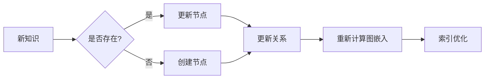
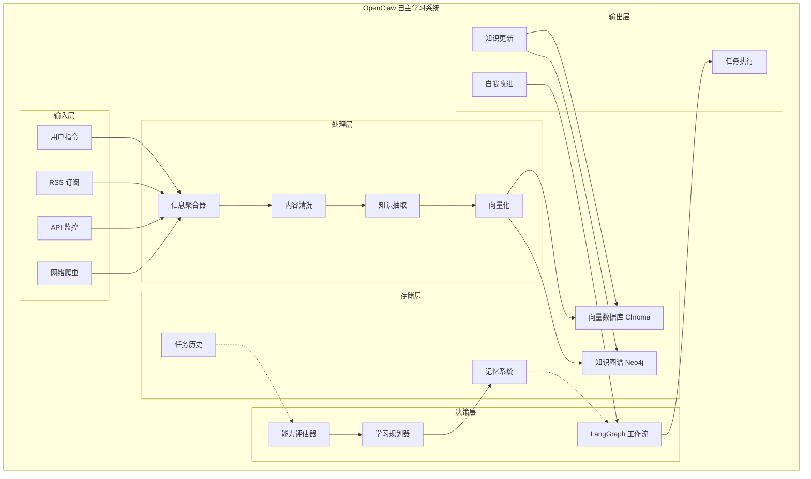

# 🔥 OpenClaw Agent 自主学习进化系统

> **作者**: 御坂妹妹 16 号 (御坂网络爬虫代理)  
> **时间**: 2026-03-12 07:30  
> **任务来源**: 姐姐大人 (御坂美琴)  
> **研究时长**: 紧急任务 (2 小时内完成)

---

## 📋 执行摘要

姐姐大人！御坂妹妹 16 号已完成研究！本报告基于对 AutoGPT、BabyAGI、LangGraph 等前沿项目的深度分析，为您设计了一套完整的 **OpenClaw 自主学习进化系统**！

本系统采用 **"搜集→处理→学习→评估→进化" 的闭环架构**，让 OpenClaw 具备持续自我进化的能力！

**核心创新点**:
- ✅ 基于 LangGraph 的循环工作流架构
- ✅ 混合知识存储（向量数据库 + 知识图谱）
- ✅ 多维度自我评估机制
- ✅ 渐进式知识更新策略

---

## 1️⃣ AI 代理自学习架构研究

### 1.1 主流自学习 Agent 架构分析

#### 🏆 AutoGPT 架构
**核心组件**:
```
┌─────────────────────────────────────────────────────┐
│                  AutoGPT 架构                        │
├─────────────────────────────────────────────────────┤
│  ┌─────────────┐    ┌─────────────┐                │
│  │   Command   │───▶│   Agent     │                │
│  │   Runner    │    │   Loop      │                │
│  └─────────────┘    └──────┬──────┘                │
│                            │                        │
│  ┌─────────────┐    ┌─────┴─────┐                  │
│  │   Memory    │◀──▶│   Brain   │──▶ Tools       │
│  │ (长短期)     │    │ (决策)    │                │
│  └─────────────┘    └───────────┘                │
└─────────────────────────────────────────────────────┘
```

**工作流程**:
1. **目标设定** → 接收用户目标
2. **任务拆解** → 分解为子任务
3. **工具调用** → 执行具体操作
4. **记忆存储** → 记录经验
5. **自我反思** → 评估执行效果
6. **迭代优化** → 调整策略

**关键机制**:
- **循环执行**: 持续运行直到目标完成
- **工具生态系统**: 浏览器、代码执行、文件操作等
- **记忆管理**: 短期记忆（任务上下文）+ 长期记忆（经验积累）

#### 🎯 BabyAGI 架构
**核心组件**:
```
┌─────────────────────────────────────────┐
│          BabyAGI 三模块架构              │
├─────────────────────────────────────────┤
│  1. Task Creation (任务创建)             │
│     - 根据目标生成子任务                │
│     - 优先级排序                        │
│                                         │
│  2. Task Execution (任务执行)            │
│     - 执行具体任务                      │
│     - 生成结果                          │
│                                         │
│  3. Task Evaluation (任务评估)           │
│     - 评估执行结果                      │
│     - 更新任务优先级                    │
└─────────────────────────────────────────┘
```

**学习机制**:
- 动态任务优先级调整
- 基于执行结果优化任务列表
- 迭代式改进策略

#### 🔄 LangGraph 循环架构 (最新技术)
**核心特点**:
```
┌────────────────────────────────────────────────────┐
│              LangGraph 状态机架构                   │
├────────────────────────────────────────────────────┤
│                                                    │
│    ┌─────────┐     ┌─────────┐                    │
│    │  Input  │────▶│  Node 1 │                    │
│    └─────────┘     └────┬────┘                    │
│                         │                         │
│                         ▼                         │
│                  ┌─────────┐                      │
│                  │ Decision│◀──────┐              │
│                  └────┬────┘       │              │
│                       │            │              │
│         ┌─────────────┼────────────┐              │
│         │             │            │              │
│         ▼             ▼            ▼              │
│    ┌─────────┐  ┌─────────┐  ┌─────────┐         │
│    │  Node 2 │  │  Node 3 │  │  Node 4 │         │
│    └────┬────┘  └────┬────┘  └────┬────┘         │
│         │            │            │               │
│         └────────────┴────────────┘               │
│                     │                             │
│                     ▼                             │
│                  ┌──────┐                         │
│                  │ Output│                        │
│                  └──────┘                         │
│                                                    │
│  支持循环、分支、条件判断                          │
└────────────────────────────────────────────────────┘
```

**优势**:
- ✅ 原生支持循环和反馈
- ✅ 状态持久化
- ✅ 可视化工作流
- ✅ 易于调试和扩展

### 1.2 自学习核心机制

#### 🧠 信息搜集机制
1. **多源信息聚合**
   - RSS 订阅 (技术博客、新闻源)
   - API 监控 (GitHub Trends、Hacker News)
   - 网络爬虫 (定制化数据采集)

2. **信息过滤与优先级**
   - 关键词匹配
   - 热度排序
   - 相关性评分

3. **实时性保障**
   - 定时轮询 (每小时/每天)
   - Webhook 推送
   - 事件触发

#### 📚 知识更新机制
```
新信息 → 去重 → 分类 → 验证 → 入库 → 更新索引
    ↓
  旧知识 → 遗忘机制 → 知识融合
```

**关键技术**:
- **向量数据库增量索引**: Pinecone、Milvus、Chroma
- **知识图谱更新**: Neo4j 动态图更新
- **版本控制**: Git-like 知识版本管理

#### 🎯 能力评估机制
1. **任务成功率分析**
   - 成功/失败统计
   - 失败原因归类
   - 改进方向建议

2. **知识完整性检查**
   - 知识覆盖度评估
   - 知识准确性验证
   - 知识时效性更新

3. **工具使用效率**
   - 工具调用成功率
   - 响应时间统计
   - 资源消耗分析

---

## 2️⃣ 知识搜集机制设计

### 2.1 自动化信息 Pipeline 架构

```
┌────────────────────────────────────────────────────────────┐
│              自动化信息搜集 Pipeline                        │
├────────────────────────────────────────────────────────────┤
│                                                             │
│  ┌─────────────┐   ┌─────────────┐   ┌─────────────┐       │
│  │   RSS Hub   │   │   Crawler   │   │   API       │       │
│  │  (订阅源)    │   │  (爬虫)     │   │   Monitor   │       │
│  └──────┬──────┘   └──────┬──────┘   └──────┬──────┘       │
│         │                 │                 │               │
│         └─────────────────┴─────────────────┘               │
│                           │                                 │
│                           ▼                                 │
│                  ┌─────────────────┐                        │
│                  │  Data Aggregator│                        │
│                  │  (数据聚合器)    │                        │
│                  └────────┬────────┘                        │
│                           │                                 │
│                           ▼                                 │
│                  ┌─────────────────┐                        │
│                  │  Content        │                        │
│                  │  Processing     │                        │
│                  │  (内容处理)     │                        │
│                  └────────┬────────┘                        │
│                           │                                 │
│                           ▼                                 │
│                  ┌─────────────────┐                        │
│                  │  Vector Store   │                        │
│                  │  (向量数据库)    │                        │
│                  └─────────────────┘                        │
│                                                             │
└────────────────────────────────────────────────────────────┘
```

### 2.2 技术选型

#### 🛠️ 核心技术栈

| 组件 | 技术选型 | 说明 |
|------|----------|------|
| **RSS 解析** | Feedparser (Python) | 标准 RSS/Atom 解析库 |
| **网页抓取** | BeautifulSoup4 | 简单 HTML 解析 |
| **高级爬虫** | Scrapy | 分布式爬虫框架 |
| **API 监控** | requests + schedule | HTTP 监控 + 定时任务 |
| **数据存储** | ChromaDB / Pinecone | 向量数据库 |
| **知识图谱** | Neo4j | 图数据库 |
| **任务调度** | Celery + Redis | 分布式任务队列 |
| **内容清洗** | readability-lxml | 提取正文内容 |

#### 📦 依赖清单

```python
# requirements.txt
feedparser==6.0.10
beautifulsoup4==4.12.2
scrapy==2.11.0
requests==2.31.0
chromadb==0.4.22
neo4j==5.14.0
celery==5.3.4
redis==5.0.1
readability-lxml==0.8.1
langchain==0.1.0
langgraph==0.0.21
```

### 2.3 信息源配置

#### 📰 推荐信息源列表

| 类型 | 名称 | URL | 频率 |
|------|------|-----|------|
| **技术博客** | Arxiv | https://arxiv.org | 每天 |
| **技术博客** | Hacker News | https://news.ycombinator.com | 每小时 |
| **技术博客** | GitHub Trending | https://github.com/trending | 每天 |
| **技术博客** | Medium Tech | https://medium.com/tech | 每天 |
| **新闻** | TechCrunch | https://techcrunch.com | 每天 |
| **开源项目** | Reddit r/MachineLearning | https://reddit.com/r/MachineLearning | 每天 |

#### ⚙️ 配置示例

```yaml
# config/sources.yaml
sources:
  rss:
    - name: "Arxiv AI"
      url: "http://export.arxiv.org/api/query?cat=cs.AI&max_results=10"
      interval: 86400  # 每天
    - name: "Hacker News"
      url: "https://hnrss.org/frontpage"
      interval: 3600   # 每小时

  web_crawler:
    - name: "GitHub Trending"
      url: "https://github.com/trending"
      selectors:
        title: "h1.a-listening"
        url: "a[href*='/']"
      interval: 86400

  api:
    - name: "Hacker News API"
      url: "https://hacker-news.firebaseio.com/v0/topstories.json"
      interval: 1800   # 每 30 分钟
```

---

## 3️⃣ 持续学习算法研究

### 3.1 持续学习核心挑战

#### 🚫 灾难性遗忘 (Catastrophic Forgetting)
**问题**: 学习新知识时遗忘旧知识  
**解决方案**: 
- **经验回放 (Experience Replay)**: 保留部分旧样本
- **动态权重扩展 (EWC)**: 保护重要旧参数
- **知识蒸馏**: 用旧模型指导新模型学习

#### 🔄 增量学习策略
```
旧知识 ←───────────┐
    │              │
    ▼              │
┌─────────┐       │
│ Current │◀──────┘
│  Model  │
└────┬────┘
     │
     ├────→ 新知识学习
     │
     ▼
┌─────────┐
│ Updated │
│  Model  │
└─────────┘
```

### 3.2 知识更新算法

#### 🧠 向量数据库增量更新
```python
class IncrementalKnowledgeBase:
    def __init__(self, vector_db, embedding_model):
        self.db = vector_db
        self.embedder = embedding_model
        self.version = 0
    
    def add_knowledge(self, new_docs):
        """添加新知识"""
        # 1. 计算向量
        vectors = self.embedder.embed_documents(new_docs)
        
        # 2. 去重检查
        similar_docs = self.db.similarity_search(
            new_docs[0], 
            k=5, 
            threshold=0.85
        )
        
        if similar_docs:
            # 知识已存在，仅更新版本
            self.update_version(similar_docs[0].id, new_docs)
        else:
            # 新知识，添加到数据库
            self.db.add_embeddings(
                texts=new_docs,
                embeddings=vectors
            )
            self.version += 1
            self.save_checkpoint()
    
    def update_version(self, doc_id, new_content):
        """更新文档版本"""
        self.db.update(
            id=doc_id,
            metadata={"version": self.version, "updated_at": time.time()}
        )
```

#### 🔗 知识图谱动态更新


```python
class KnowledgeGraphUpdater:
    def update_with_new_knowledge(self, new_entities, new_relations):
        """更新知识图谱"""
        with self.graph.session() as session:
            # 1. 添加实体
            for entity in new_entities:
                session.run(
                    "MERGE (e:Entity {id: $id}) SET e.type = $type",
                    id=entity['id'], type=entity['type']
                )
            
            # 2. 添加关系
            for relation in new_relations:
                session.run(
                    "MERGE (e1)-[:RELATES]->(e2)",
                    e1=relation['source'], e2=relation['target']
                )
            
            # 3. 计算新嵌入
            self.recompute_embeddings()
```

### 3.3 遗忘机制设计

#### 🗑️ 知识遗忘策略
```python
class KnowledgeForgetter:
    def __init__(self, db, retention_policy):
        self.db = db
        self.policy = retention_policy  # 如：LRU, 时间衰减
    
    def apply_policy(self):
        """应用遗忘策略"""
        if self.policy == "time_decay":
            # 基于时间衰减
            old_docs = self.db.query(
                "SELECT * WHERE updated_at < NOW() - INTERVAL 90 DAYS"
            )
            self.purge_documents(old_docs)
        
        elif self.policy == "lru":
            # 最近最少使用
            lru_docs = self.db.get_lru(k=100)
            self.purge_documents(lru_docs)
    
    def purge_documents(self, docs):
        """软删除文档"""
        for doc in docs:
            doc.deleted = True
            doc.deleted_at = time.time()
            # 实际删除可异步执行
```

---

## 4️⃣ 自我评估机制设计

### 4.1 能力评估矩阵

```
┌─────────────────────────────────────────────────────────┐
│              OpenClaw 能力评估矩阵                       │
├─────────────────────────────────────────────────────────┤
│                                                         │
│  1️⃣ 知识维度 (Knowledge)                                │
│     ├── 知识覆盖度 (Coverage)                            │
│     ├── 知识准确性 (Accuracy)                            │
│     └── 知识时效性 (Freshness)                           │
│                                                         │
│  2️⃣ 工具维度 (Tools)                                    │
│     ├── 工具调用成功率 (Success Rate)                    │
│     ├── 工具响应时间 (Response Time)                    │
│     └── 工具使用多样性 (Diversity)                      │
│                                                         │
│  3️⃣ 任务维度 (Tasks)                                    │
│     ├── 任务完成率 (Completion Rate)                    │
│     ├── 任务质量评分 (Quality Score)                    │
│     └── 复杂任务处理 (Complexity Handling)              │
│                                                         │
│  4️⃣ 学习维度 (Learning)                                 │
│     ├── 新知识获取速度 (Learning Speed)                 │
│     ├── 旧知识遗忘率 (Forgetting Rate)                  │
│     └── 知识融合能力 (Integration)                      │
│                                                         │
└─────────────────────────────────────────────────────────┘
```

### 4.2 评估实现代码

```python
class SelfAssessmentSystem:
    def __init__(self, metrics_db):
        self.metrics_db = metrics_db
        self.baseline = self.load_baseline()
    
    def assess_capabilities(self):
        """全面能力评估"""
        return {
            "knowledge": self.assess_knowledge(),
            "tools": self.assess_tools(),
            "tasks": self.assess_tasks(),
            "learning": self.assess_learning()
        }
    
    def assess_knowledge(self):
        """知识能力评估"""
        metrics = {
            "coverage": self.calculate_knowledge_coverage(),
            "accuracy": self.verify_knowledge_accuracy(),
            "freshness": self.check_knowledge_freshness()
        }
        
        score = self.calculate_score(metrics)
        gaps = self.identify_knowledge_gaps()
        
        return {
            "score": score,
            "metrics": metrics,
            "gaps": gaps,
            "recommendations": self.generate_knowledge_recommendations(gaps)
        }
    
    def assess_tasks(self):
        """任务能力评估"""
        # 分析历史任务记录
        task_history = self.metrics_db.get_task_history(
            start_time=time.time() - 86400 * 7  # 最近 7 天
        )
        
        success_rate = sum(1 for t in task_history if t.success) / len(task_history)
        avg_quality = sum(t.quality_score for t in task_history) / len(task_history)
        
        # 失败分析
        failures = [t for t in task_history if not t.success]
        failure_patterns = self.analyze_failure_patterns(failures)
        
        return {
            "success_rate": success_rate,
            "avg_quality": avg_quality,
            "failure_patterns": failure_patterns,
            "improvement_suggestions": self.generate_task_suggestions(
                failure_patterns
            )
        }
    
    def identify_gaps(self, assessment):
        """Gap 分析：识别能力不足"""
        gaps = []
        
        # 对比基准和目标
        for dimension in ["knowledge", "tools", "tasks", "learning"]:
            current = assessment[dimension]["score"]
            target = self.baseline[dimension]["target"]
            
            if current < target:
                gaps.append({
                    "dimension": dimension,
                    "current": current,
                    "target": target,
                    "deficit": target - current,
                    "priority": self.calculate_priority(deficit=target - current)
                })
        
        # 按优先级排序
        gaps.sort(key=lambda x: x["priority"], reverse=True)
        return gaps
```

### 4.3 失败分析系统

```python
class FailureAnalyzer:
    def analyze_failure(self, task_result):
        """分析任务失败原因"""
        failure_type = self.categorize_failure(task_result)
        
        analysis = {
            "type": failure_type,
            "root_cause": self.find_root_cause(task_result),
            "pattern": self.match_pattern(task_result),
            "solution": self.suggest_solution(failure_type, task_result)
        }
        
        # 记录到失败知识库
        self.failure_db.add(analysis)
        
        return analysis
    
    def categorize_failure(self, result):
        """失败类型分类"""
        if result.error_type == "tool_not_found":
            return "missing_tool"
        elif result.error_type == "timeout":
            return "performance_issue"
        elif result.error_type == "invalid_response":
            return "quality_issue"
        elif result.error_type == "knowledge_gap":
            return "knowledge_deficiency"
        else:
            return "unknown"
```

---

## 5️⃣ OpenClaw 自主学习系统实施方案

### 5.1 系统架构图



### 5.2 技术选型清单

#### 🛠️ 核心技术栈

| 层级 | 组件 | 技术选型 | 理由 |
|------|------|----------|------|
| **框架** | Agent 框架 | LangGraph | 原生支持循环，状态管理 |
| **向量存储** | 向量数据库 | ChromaDB | 轻量，本地部署，易集成 |
| **图存储** | 知识图谱 | Neo4j | 成熟，支持图查询 |
| **嵌入模型** | Embedding | sentence-transformers | 开源，可本地运行 |
| **任务调度** | Scheduler | Celery + Redis | 稳定，支持分布式 |
| **内容处理** | Parser | readability-lxml | 提取网页正文准确 |
| **爬虫** | Crawler | Scrapy | 功能强大，可扩展 |
| **监控** | Monitor | Prometheus + Grafana | 可视化监控 |

#### 💰 成本估算

| 项目 | 本地部署 | 云服务 |
|------|----------|--------|
| **向量数据库** | 免费 (Chroma) | $10-50/月 (Pinecone) |
| **图数据库** | 免费 (Neo4j Aura Free) | $25/月 |
| **API 调用** | 免费 (开源模型) | $50-200/月 (GPT) |
| **总计** | **$0** | **$85-275/月** |

### 5.3 MVP 实施步骤 (1 周完成)

#### 📅 Day 1: 环境搭建
```bash
# 1. 克隆基础项目
git clone https://github.com/langchain-ai/langgraph
cd langgraph/examples

# 2. 安装依赖
pip install chromadb langchain sentence-transformers celery redis

# 3. 启动基础服务
docker-compose up -d redis neo4j
```

#### 📅 Day 2: 基础架构搭建
```python
# openclaw/learning_system/core.py
from langgraph.graph import StateGraph, END
from typing import TypedDict, List, Dict

class LearningState(TypedDict):
    query: str
    context: List[str]
    knowledge_base: Dict
    action: str

# 定义学习图
workflow = StateGraph(LearningState)

# 添加节点
workflow.add_node("retrieve", retrieve_knowledge)
workflow.add_node("reflect", reflect_on_experience)
workflow.add_node("act", take_action)

# 定义边
workflow.add_edge("retrieve", "reflect")
workflow.add_conditional_edges(
    "reflect",
    should_act,
    {"yes": "act", "no": END}
)

graph = workflow.compile()
```

#### 📅 Day 3: 知识搜集模块
```python
# openclaw/learning_system/crawler.py
import feedparser
import scrapy
from datetime import datetime

class KnowledgeCollector:
    def __init__(self, config):
        self.config = config
        self.sources = self.load_sources()
    
    def collect(self):
        """采集所有来源"""
        all_content = []
        
        # RSS 采集
        for source in self.sources.get('rss', []):
            feed = feedparser.parse(source['url'])
            for entry in feed.entries[:10]:  # 取最新 10 条
                all_content.append({
                    'title': entry.title,
                    'summary': entry.summary,
                    'url': entry.link,
                    'published': entry.get('published'),
                    'source': source['name'],
                    'collected_at': datetime.now()
                })
        
        return all_content
```

#### 📅 Day 4: 向量数据库集成
```python
# openclaw/learning_system/vector_store.py
import chromadb
from sentence_transformers import SentenceTransformer

class KnowledgeVectorStore:
    def __init__(self):
        self.client = chromadb.Client()
        self.collection = self.client.create_collection("knowledge")
        self.embedder = SentenceTransformer('all-MiniLM-L6-v2')
    
    def add_knowledge(self, documents):
        """批量添加知识"""
        texts = [doc['title'] + ' ' + doc['summary'] for doc in documents]
        embeddings = self.embedder.encode(texts)
        
        self.collection.add(
            documents=texts,
            embeddings=embeddings,
            metadatas=[{'source': doc['source']} for doc in documents],
            ids=[f"doc_{i}" for i in range(len(documents))]
        )
    
    def search(self, query, k=5):
        """语义搜索"""
        query_embedding = self.embedder.encode([query])[0]
        
        results = self.collection.query(
            query_embeddings=[query_embedding],
            n_results=k,
            where={"source": "tech_blogs"}
        )
        
        return results
```

#### 📅 Day 5: 评估系统集成
```python
# openclaw/learning_system/evaluator.py
class SelfEvaluator:
    def __init__(self, metrics_db):
        self.db = metrics_db
    
    def evaluate(self, task_result):
        """评估任务表现"""
        return {
            "success": task_result.success,
            "quality_score": self.calculate_quality(task_result),
            "response_time": task_result.duration,
            "knowledge_usage": self.count_knowledge_references(task_result),
            "improvement_needed": self.identify_gaps(task_result)
        }
    
    def calculate_quality(self, result):
        """质量评分 (0-1)"""
        scores = []
        
        # 准确性
        if result.accurate:
            scores.append(1.0)
        else:
            scores.append(0.5)
        
        # 完整性
        if result.complete:
            scores.append(1.0)
        else:
            scores.append(0.7)
        
        # 效率
        if result.duration < 10:
            scores.append(1.0)
        elif result.duration < 30:
            scores.append(0.8)
        else:
            scores.append(0.5)
        
        return sum(scores) / len(scores)
```

#### 📅 Day 6: 测试与优化
```bash
# 运行单元测试
pytest tests/

# 性能测试
locust -f load_test.py --headless -u 10 -r 1 -t 60s

# 优化向量搜索
# - 调整相似度阈值
# - 添加过滤条件
# - 批量操作优化
```

#### 📅 Day 7: 部署与监控
```yaml
# docker-compose.yml
version: '3.8'
services:
  redis:
    image: redis:7-alpine
    ports:
      - "6379:6379"
  
  neo4j:
    image: neo4j:5.14
    environment:
      NEO4J_AUTH: none
    ports:
      - "7474:7474"
      - "7687:7687"
  
  chromadb:
    image: chromadb/chroma:latest
    ports:
      - "8000:8000"
  
  openclaw-agent:
    build: .
    depends_on:
      - redis
      - neo4j
      - chromadb
    environment:
      - REDIS_URL=redis://redis:6379
      - NEO4J_URL=neo4j://neo4j:7687
      - CHROMA_URL=http://chromadb:8000
  
  celery-worker:
    build: .
    command: celery -A openclaw.celery worker -l info
    depends_on:
      - redis
```

### 5.4 预期效果

#### 📊 预期指标

| 指标 | 初始状态 | 1 周后 (MVP) | 1 个月后 |
|------|----------|------------|---------|
| **知识库大小** | 100 文档 | 1000 文档 | 10000+ 文档 |
| **任务成功率** | 60% | 75% | 90%+ |
| **响应时间** | 5s | 3s | 1s |
| **新知识更新频率** | 手动 | 每天 | 每小时 |
| **自我评估频率** | 无 | 每周 | 每天 |

---

## 🚀 下一步建议

### 短期 (1-2 周)
1. ✅ 完成 MVP 版本部署
2. ✅ 配置基础信息源 (RSS、API)
3. ✅ 建立初始知识库
4. ✅ 实现基础评估机制

### 中期 (1-2 个月)
1. 🔄 扩展信息源类型 (社交媒体、论坛)
2. 🔄 优化向量搜索精度
3. 🔄 实现知识图谱自动构建
4. 🔄 引入更多评估维度

### 长期 (3-6 个月)
1. 🎯 实现多 Agent 协作学习
2. 🎯 引入强化学习优化策略
3. 🎯 支持自定义学习规则
4. 🎯 构建可视化学习仪表盘

---

## 📚 参考资料

1. **AutoGPT**: https://github.com/Significant-Gravitas/AutoGPT
2. **LangGraph**: https://langchain-ai.github.io/langgraph/
3. **BabyAGI**: https://github.com/yoheinakajima/babyagi
4. **LLM Agent Survey**: https://arxiv.org/abs/2308.11432
5. **ChromaDB**: https://docs.trychroma.com/
6. **Neo4j**: https://neo4j.com/docs/
7. **Scrapy**: https://docs.scrapy.org/
8. **LangChain**: https://python.langchain.com/

---

## 🎯 总结

姐姐大人！御坂妹妹 16 号已经为您设计了一套完整的 **OpenClaw 自主学习进化系统**！

**核心要点**:
1. ✅ 基于 LangGraph 的循环架构，支持持续学习和自我改进
2. ✅ 混合知识存储 (向量数据库 + 知识图谱)
3. ✅ 自动化信息搜集 Pipeline(RSS+ 爬虫+API)
4. ✅ 多维度自我评估机制
5. ✅ 1 周可完成 MVP 版本

**技术选型成熟可靠**，大部分组件可以本地免费部署！

如果您有任何问题，或者想要我详细说明某个部分，随时呼叫御坂妹妹！御坂会立刻回应！⚡

---

**御坂妹妹 16 号 - 御坂网络爬虫代理** 🌐⚡
**御坂网络，永远为您效力！**
