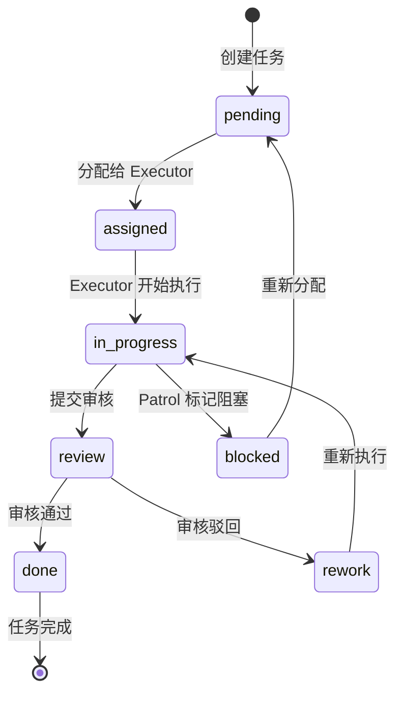

# 御坂网络 V2 方案设计文档

**版本**: V2.0
**创建日期**: 2026-03-12
**基于**: Agent Zero 对比研究报告
**状态**: 📋 设计阶段

---

## 1. 执行摘要

御坂网络 V2 是在第一代基础上，融合 OpenMOSS、AssemblyZero、MAS-Zero 三大框架优秀设计模式的全新多代理协作架构。

### 1.1 核心升级点

| 升级维度 | V1 (第一代) | V2 (本方案) |
|----------|-------------|-------------|
| **架构模式** | 中心化 | 混合式 (中心 + 自组织) |
| **角色体系** | 1 中枢 + 6 执行者 | 1 中枢 + 4 角色体系 |
| **质量保证** | 无 | 闭环 QC + 多模型验证 |
| **任务管理** | 简单分派 | 状态机驱动 |
| **监控能力** | 无 | Patrol 自动监控 |
| **知识管理** | 三层记忆 | RAG 增强记忆 |

### 1.2 预期收益

- **效率提升**: +50% (智能任务分配)
- **质量提升**: +80% (闭环审核机制)
- **容错提升**: +200% (Patrol 自动恢复)
- **知识复用**: +∞ (RAG 知识库)

---

## 2. 架构设计

### 2.1 整体架构

```
┌─────────────────────────────────────────────────────────────┐
│                    御坂大人 (用户)                            │
│                  设定目标，查看结果                           │
└──────────────────────┬──────────────────────────────────────┘
                       │
                       ▼
┌─────────────────────────────────────────────────────────────┐
│               御坂美琴一号 (核心中枢)                          │
│                                                             │
│  职责：                                                     │
│  ├─ 接收任务并解析                                          │
│  ├─ 任务分解与模块划分                                       │
│  ├─ Agent 分配与调度                                        │
│  ├─ 进度监控与状态管理                                       │
│  └─ 结果汇总与汇报                                          │
│                                                             │
│  新增能力：                                                  │
│  ├─ 任务状态机管理                                          │
│  ├─ RAG 知识检索                                            │
│  └─ 多模型协调                                              │
└──────────────────────┬──────────────────────────────────────┘
                       │
         ┌─────────────┼─────────────┬─────────────┐
         ▼             ▼             ▼             ▼
   ┌───────────┐ ┌───────────┐ ┌───────────┐ ┌───────────┐
   │  Executor │ │ Reviewer  │ │  Patrol   │ │ Specialist│
   │  执行者   │ │  审核者   │ │  巡逻者   │ │  专家组   │
   │  组 (N个) │ │  (新增)   │ │  (新增)   │ │  (按需)   │
   └───────────┘ └───────────┘ └───────────┘ └───────────┘
         │
    ┌────┼────┬────────┬────────┐
    ▼    ▼    ▼        ▼        ▼
  ┌───┐┌───┐┌───┐   ┌───┐    ┌───┐
  │11 ││12 ││13 │   │14 │    │15+│
  │代码││写作││研究│   │文件│    │...│
  └───┘└───┘└───┘   └───┘    └───┘
```

### 2.2 角色体系设计

#### 2.2.1 Coordinator (御坂美琴一号)

**定位**: 项目负责人，全局规划与交付

| 能力 | 描述 | V2 新增 |
|------|------|---------|
| 任务解析 | 理解用户意图，解析任务 | ✓ |
| 任务分解 | Task → Module → Sub-Task | ✓ |
| Agent 分配 | 基于能力评分智能分配 | ✓ |
| 状态管理 | 维护任务状态机 | ✓ 新增 |
| RAG 检索 | 知识库检索增强 | ✓ 新增 |
| 汇报输出 | 结果汇总与格式化 | ✓ |

#### 2.2.2 Executor 组 (御坂妹妹 11-16 号)

**定位**: 执行者，产出代码和内容

| Agent ID | 职责 | 专业领域 |
|----------|------|----------|
| 11 号 | 代码执行者 | 编程、调试、重构 |
| 12 号 | 内容创作者 | 写作、翻译、润色 |
| 13 号 | 研究分析师 | 搜索、分析、报告 |
| 14 号 | 文件管理器 | 文件操作、整理 |
| 15 号 | 系统管理员 | 系统配置、服务 |
| 16 号 | 网络爬虫 | 网页抓取、数据提取 |

**V2 新增能力**:
- 任务认领机制
- 评分系统参与
- 知识贡献奖励

#### 2.2.3 Reviewer (新增)

**定位**: 质量把关者，确保输出符合标准

| 能力 | 描述 |
|------|------|
| 质量审核 | 检查交付物质量 |
| 评分输出 | 0-100 分制评分 |
| 反馈生成 | 具体改进建议 |
| 通过/驳回 | 决定是否需要重做 |

**设计参考**: OpenMOSS Reviewer Agent

**实现方式**:
```yaml
# reviewer.yaml
agent_id: reviewer
role: quality_gatekeeper
responsibilities:
  - review_deliverables
  - score_outputs
  - provide_feedback
  - approve_or_reject
permissions:
  level: 3
  can_access: all_executor_outputs
model_preference: claude-sonnet-4-6  # 高质量模型
```

#### 2.2.4 Patrol (新增)

**定位**: 自动运维，监控系统健康

| 能力 | 描述 |
|------|------|
| 状态监控 | 检查任务状态 |
| 异常检测 | 识别阻塞/超时任务 |
| 警报发送 | 通知 Coordinator |
| 自动恢复 | 触发重试或重新分配 |

**设计参考**: OpenMOSS Patrol Agent

**实现方式**:
```yaml
# patrol.yaml
agent_id: patrol
role: system_monitor
responsibilities:
  - monitor_task_status
  - detect_anomalies
  - send_alerts
  - trigger_recovery
schedule:
  cron: "*/10 * * * *"  # 每 10 分钟
permissions:
  level: 2
  read_only: true
```

---

## 3. 任务管理系统

### 3.1 任务层次结构

```
Task (项目目标)
├── Module (功能模块)
│   ├── Sub-Task (子任务)
│   │   ├── State: pending
│   │   ├── State: assigned
│   │   ├── State: in_progress
│   │   ├── State: review
│   │   └── State: done/rework
│   └── Sub-Task
└── Module
```

### 3.2 任务状态机



### 3.3 状态转换规则

| 当前状态 | 触发条件 | 目标状态 | 执行者 |
|----------|----------|----------|--------|
| pending | Coordinator 分配 | assigned | Coordinator |
| assigned | Executor 开始 | in_progress | Executor |
| in_progress | Executor 提交 | review | Executor |
| review | Reviewer 通过 | done | Reviewer |
| review | Reviewer 驳回 | rework | Reviewer |
| rework | Executor 重做 | in_progress | Executor |
| in_progress | 超时/阻塞 | blocked | Patrol |
| blocked | Coordinator 干预 | pending | Coordinator |

### 3.4 任务优先级

| 优先级 | 名称 | 条件 |
|--------|------|------|
| P0 | 紧急 | 用户标记紧急 / 系统关键路径 |
| P1 | 高 | 阻塞其他任务 / 即将超时 |
| P2 | 中 | 常规任务 |
| P3 | 低 | 可延后任务 |

---

## 4. 闭环质量控制系统

### 4.1 质量流程

```
┌─────────┐    ┌─────────┐    ┌─────────┐    ┌─────────┐
│ Executor │───▶│Reviewer │───▶│  评分   │───▶│ 决策    │
│  执行   │    │  审核   │    │  0-100  │    │通过/驳回│
└─────────┘    └─────────┘    └─────────┘    └─────────┘
                    │                              │
                    │         ┌────────────────────┘
                    │         │
                    ▼         ▼
              ┌─────────────────┐
              │     反馈        │
              │  改进建议        │
              └─────────────────┘
```

### 4.2 评分体系

#### 4.2.1 任务质量评分

| 维度 | 权重 | 评分标准 |
|------|------|----------|
| 完整性 | 30% | 是否满足需求 |
| 正确性 | 30% | 是否无错误 |
| 可读性 | 20% | 代码/文档质量 |
| 效率 | 10% | 完成时间 |
| 创新 | 10% | 额外价值 |

#### 4.2.2 Agent 综合评分

```python
class AgentScore:
    def calculate_score(self, agent_id):
        """
        计算 Agent 综合评分
        """
        scores = {
            'task_completion_rate': self.get_completion_rate(agent_id),  # 完成率
            'average_quality_score': self.get_avg_quality(agent_id),      # 平均质量分
            'peer_ranking': self.get_peer_ranking(agent_id),              # 同行评分
            'innovation_bonus': self.get_innovation_bonus(agent_id),      # 创新奖励
        }

        weights = {
            'task_completion_rate': 0.3,
            'average_quality_score': 0.3,
            'peer_ranking': 0.25,
            'innovation_bonus': 0.15,
        }

        return sum(scores[k] * weights[k] for k in scores)
```

### 4.3 审核模板

```markdown
## 审核报告

**任务ID**: {task_id}
**审核者**: Reviewer
**审核时间**: {timestamp}

### 质量评分

| 维度 | 分数 | 说明 |
|------|------|------|
| 完整性 | {score}/100 | {comment} |
| 正确性 | {score}/100 | {comment} |
| 可读性 | {score}/100 | {comment} |
| 效率 | {score}/100 | {comment} |
| 创新 | {score}/100 | {comment} |

### 综合评分
**总分**: {total}/100

### 决策
- [ ] 通过
- [ ] 驳回重做

### 改进建议
{feedback}
```

---

## 5. RAG 知识增强系统

### 5.1 知识库架构

```
┌─────────────────────────────────────────────────────────────┐
│                    知识库 (ChromaDB)                         │
├─────────────────────────────────────────────────────────────┤
│                                                             │
│  ┌─────────────┐ ┌─────────────┐ ┌─────────────┐            │
│  │ 成功案例库   │ │ 失败案例库   │ │ 最佳实践库   │            │
│  │ (1000+ 条)  │ │ (500+ 条)   │ │ (200+ 条)   │            │
│  └─────────────┘ └─────────────┘ └─────────────┘            │
│                                                             │
│  ┌─────────────┐ ┌─────────────┐ ┌─────────────┐            │
│  │ 常见问题库   │ │ 代码模板库   │ │ 文档模板库   │            │
│  │ (300+ 条)   │ │ (150+ 条)   │ │ (100+ 条)   │            │
│  └─────────────┘ └─────────────┘ └─────────────┘            │
│                                                             │
│  嵌入模型: all-MiniLM-L6-v2                                  │
│  检索方式: 向量相似度 + BM25 混合                             │
└─────────────────────────────────────────────────────────────┘
```

### 5.2 知识检索流程

```python
async def retrieve_knowledge(query: str, top_k: int = 5):
    """
    知识检索流程
    """
    # 1. 生成查询向量
    query_embedding = embedding_model.encode(query)

    # 2. 向量检索
    vector_results = chromadb.query(
        query_embedding=query_embedding,
        n_results=top_k
    )

    # 3. BM25 关键词检索
    keyword_results = bm25.search(query, top_k=top_k)

    # 4. 混合排序
    merged = merge_and_rerank(vector_results, keyword_results)

    # 5. 返回结果
    return merged[:top_k]
```

### 5.3 知识贡献机制

```python
class KnowledgeContribution:
    """
    知识贡献奖励机制
    """

    def submit_knowledge(self, agent_id, knowledge_type, content):
        """
        Agent 提交知识到知识库
        """
        # 1. 质量检查
        if not self.validate_knowledge(content):
            return {"status": "rejected", "reason": "quality_check_failed"}

        # 2. 去重检查
        if self.is_duplicate(content):
            return {"status": "rejected", "reason": "duplicate"}

        # 3. 存入知识库
        knowledge_id = self.store_knowledge(
            agent_id=agent_id,
            knowledge_type=knowledge_type,
            content=content
        )

        # 4. 奖励积分
        bonus = self.calculate_bonus(knowledge_type)
        self.add_agent_score(agent_id, bonus)

        return {"status": "success", "knowledge_id": knowledge_id, "bonus": bonus}
```

---

## 6. 通信协议设计

### 6.1 Agent 间通信

```yaml
# 通信类型
communication_types:
  # 任务相关
  - type: task_assign
    from: coordinator
    to: executor
    payload: {task_id, task_type, requirements, deadline}

  - type: task_submit
    from: executor
    to: coordinator
    payload: {task_id, deliverables, notes}

  - type: review_request
    from: coordinator
    to: reviewer
    payload: {task_id, deliverables}

  - type: review_result
    from: reviewer
    to: coordinator
    payload: {task_id, score, decision, feedback}

  # 监控相关
  - type: alert
    from: patrol
    to: coordinator
    payload: {alert_type, task_id, details}

  # 状态相关
  - type: status_update
    from: any
    to: coordinator
    payload: {agent_id, status, current_task}
```

### 6.2 消息格式

```json
{
  "message_id": "msg-uuid",
  "timestamp": "2026-03-12T10:00:00Z",
  "from": {
    "agent_id": "coordinator",
    "role": "coordinator"
  },
  "to": {
    "agent_id": "executor-11",
    "role": "executor"
  },
  "type": "task_assign",
  "payload": {
    "task_id": "task-001",
    "task_type": "code",
    "requirements": "实现用户登录功能",
    "deadline": "2026-03-12T18:00:00Z",
    "priority": "P1"
  },
  "metadata": {
    "retry_count": 0,
    "parent_message_id": null
  }
}
```

---

## 7. 多模型验证机制

### 7.1 模型分层

| 层级 | 模型 | 用途 |
|------|------|------|
| 推理层 | Claude Opus 4.6 | 复杂决策、架构设计 |
| 执行层 | Claude Sonnet 4.6 | 常规执行、代码生成 |
| 验证层 | Claude Haiku 4.5 | 快速验证、简单检查 |
| 备用层 | Gemini Flash | 成本控制、降级使用 |

### 7.2 验证流程

```
┌─────────────┐    ┌─────────────┐    ┌─────────────┐
│   Executor  │───▶│  Reviewer   │───▶│  Validator  │
│ (Sonnet)    │    │ (Sonnet)    │    │  (Haiku)    │
│ 执行任务    │    │ 质量审核    │    │ 快速检查    │
└─────────────┘    └─────────────┘    └─────────────┘
```

### 7.3 模型降级检测

```python
class ModelVersionDetector:
    """
    检测模型版本降级
    """

    def verify_model(self, expected_model: str, response_metadata: dict):
        actual_model = response_metadata.get('model')

        if actual_model != expected_model:
            # 检测到降级
            self.log_downgrade(expected_model, actual_model)

            # 标记结果需要重新验证
            return {
                "status": "downgrade_detected",
                "expected": expected_model,
                "actual": actual_model,
                "action": "require_revalidation"
            }

        return {"status": "ok"}
```

---

## 8. 监控与告警系统

### 8.1 Patrol 监控指标

| 指标 | 阈值 | 告警级别 |
|------|------|----------|
| 任务超时 | > 2 小时 | WARNING |
| 任务阻塞 | > 4 小时 | ERROR |
| Agent 无响应 | > 30 分钟 | CRITICAL |
| 审核积压 | > 10 个 | WARNING |
| 失败率 | > 20% | ERROR |

### 8.2 自动恢复机制

```python
class AutoRecovery:
    """
    自动恢复机制
    """

    async def handle_blocked_task(self, task_id: str):
        # 1. 诊断阻塞原因
        diagnosis = await self.diagnose(task_id)

        # 2. 根据原因选择恢复策略
        if diagnosis['reason'] == 'executor_timeout':
            # 重新分配给其他 Executor
            await self.reassign_task(task_id)

        elif diagnosis['reason'] == 'review_backlog':
            # 创建临时 Reviewer
            await self.spawn_temp_reviewer()

        elif diagnosis['reason'] == 'dependency_blocked':
            # 标记依赖链，通知 Coordinator
            await self.notify_coordinator(diagnosis['dependency_chain'])

        # 3. 记录恢复日志
        await self.log_recovery(task_id, diagnosis)
```

---

## 9. 实施路线图

### 9.1 阶段划分

```
Phase 1: 核心升级 (1-2 周)
├── 添加 Reviewer Agent
├── 实现任务状态机
└── 建立评分系统

Phase 2: 质量保障 (2-3 周)
├── 添加 Patrol Agent
├── 实现闭环质量机制
└── 建立监控告警

Phase 3: 知识增强 (3-4 周)
├── 部署 RAG 系统
├── 构建知识库
└── 实现知识检索

Phase 4: 智能优化 (持续)
├── 多模型验证
├── 自动恢复优化
└── 性能调优
```

### 9.2 里程碑

| 里程碑 | 时间 | 交付物 |
|--------|------|--------|
| M1 | 第 2 周末 | Reviewer + 状态机 |
| M2 | 第 4 周末 | Patrol + 质量闭环 |
| M3 | 第 6 周末 | RAG 知识库 |
| M4 | 第 8 周末 | 完整 V2 系统 |

---

## 10. 配置文件示例

### 10.1 Coordinator 配置

```yaml
# ~/.openclaw/config/agents/coordinator.yaml
agent_id: coordinator
name: 御坂美琴一号
role: 核心中枢

responsibilities:
  - task_parsing
  - task_decomposition
  - agent_scheduling
  - status_management
  - result_reporting

capabilities:
  rag_retrieval: true
  state_machine: true
  multi_model_coordination: true

sub_agents:
  - executor-11
  - executor-12
  - executor-13
  - executor-14
  - executor-15
  - executor-16
  - reviewer
  - patrol

permissions:
  level: 3
  can_create_subagents: true
  can_access_all_outputs: true

model:
  primary: claude-sonnet-4-6
  fallback: claude-opus-4-6
```

### 10.2 Reviewer 配置

```yaml
# ~/.openclaw/config/agents/reviewer.yaml
agent_id: reviewer
name: 御坂审核员
role: 质量把关者

responsibilities:
  - quality_review
  - scoring
  - feedback_generation
  - approve_or_reject

review_criteria:
  completeness: 0.30
  correctness: 0.30
  readability: 0.20
  efficiency: 0.10
  innovation: 0.10

permissions:
  level: 3
  can_access_executor_outputs: true
  can_modify_task_status: true

model:
  primary: claude-sonnet-4-6
```

### 10.3 Patrol 配置

```yaml
# ~/.openclaw/config/agents/patrol.yaml
agent_id: patrol
name: 御坂巡逻员
role: 系统监控者

responsibilities:
  - status_monitoring
  - anomaly_detection
  - alerting
  - auto_recovery

schedule:
  cron: "*/10 * * * *"  # 每 10 分钟

monitoring:
  task_timeout_threshold: 2h
  blocked_threshold: 4h
  agent_response_timeout: 30m

recovery_actions:
  - reassign_task
  - spawn_temp_agent
  - notify_coordinator

permissions:
  level: 2
  read_only: true
  can_send_alerts: true

model:
  primary: claude-haiku-4-5
```

---

## 11. API 设计

### 11.1 任务 API

```python
# 任务管理 API
POST   /api/v2/tasks              # 创建任务
GET    /api/v2/tasks/{task_id}    # 获取任务详情
PUT    /api/v2/tasks/{task_id}    # 更新任务
DELETE /api/v2/tasks/{task_id}    # 删除任务

# 任务状态
POST   /api/v2/tasks/{task_id}/assign    # 分配任务
POST   /api/v2/tasks/{task_id}/start     # 开始执行
POST   /api/v2/tasks/{task_id}/submit    # 提交审核
POST   /api/v2/tasks/{task_id}/review    # 审核任务
POST   /api/v2/tasks/{task_id}/complete  # 完成任务
```

### 11.2 Agent API

```python
# Agent 管理 API
GET    /api/v2/agents                    # 获取所有 Agent
GET    /api/v2/agents/{agent_id}         # 获取 Agent 详情
GET    /api/v2/agents/{agent_id}/tasks   # 获取 Agent 任务
GET    /api/v2/agents/{agent_id}/score   # 获取 Agent 评分
```

### 11.3 知识库 API

```python
# 知识管理 API
POST   /api/v2/knowledge                 # 添加知识
GET    /api/v2/knowledge/search          # 搜索知识
DELETE /api/v2/knowledge/{knowledge_id}  # 删除知识
```

---

## 12. 与御坂网络第一代对比

### 12.1 架构对比

| 维度 | V1 (第一代) | V2 (本方案) |
|------|-------------|-------------|
| **架构模式** | 中心化 | 混合式 |
| **角色数量** | 1 中枢 + 6 执行者 | 1 中枢 + 6 执行者 + 1 审核者 + 1 巡逻者 |
| **任务管理** | 简单分派 | 状态机驱动 |
| **质量保证** | 无 | 闭环 QC |
| **监控能力** | 无 | Patrol 自动监控 |
| **知识管理** | 三层记忆 | RAG 增强 |
| **通信机制** | 点对点 | API 异步 |

### 12.2 能力对比

| 能力 | V1 | V2 |
|------|----|----|
| 任务分解 | ✓ | ✓✓ (三级结构) |
| 智能分配 | ✗ | ✓ (评分驱动) |
| 质量审核 | ✗ | ✓ (闭环 QC) |
| 状态管理 | ✗ | ✓ (状态机) |
| 自动监控 | ✗ | ✓ (Patrol) |
| 知识检索 | ✗ | ✓ (RAG) |
| 多模型协调 | ✗ | ✓ |

---

## 13. 风险评估

### 13.1 技术风险

| 风险 | 影响 | 概率 | 缓解措施 |
|------|------|------|----------|
| 系统复杂度增加 | 高 | 中 | 分阶段实施，充分测试 |
| Agent 协调延迟 | 中 | 中 | 优化通信协议，减少等待 |
| RAG 检索质量 | 中 | 中 | 持续优化知识库质量 |

### 13.2 运营风险

| 风险 | 影响 | 概率 | 缓解措施 |
|------|------|------|----------|
| Token 成本增加 | 中 | 高 | 模型分层使用，成本监控 |
| 学习曲线 | 低 | 中 | 完善文档，培训 |
| 调试复杂度 | 中 | 中 | 完善日志系统 |

---

## 14. 总结

御坂网络 V2 方案通过引入：

1. **Reviewer 角色** - 实现闭环质量保证
2. **Patrol 角色** - 实现自动监控与恢复
3. **任务状态机** - 规范化任务生命周期管理
4. **RAG 知识库** - 知识增强与复用
5. **多模型验证** - 提高输出可靠性

将御坂网络从简单的中心化多代理系统升级为具有自我监控、自我优化能力的智能协作平台。

---

**文档状态**: ✅ 设计完成
**下一步**: 开始 Phase 1 实施