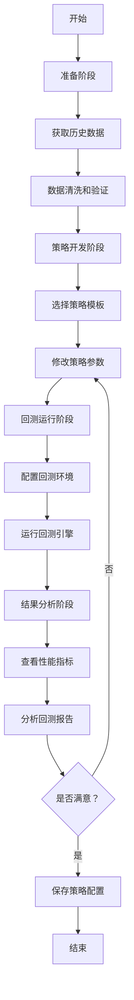

# Backtrader 回测系统技能规范

## 技能信息

- **技能名称**: backtrader
- **技能版本**: 1.0.0
- **描述**: 专业的量化交易回测系统，基于 backtrader 框架，提供完整的历史数据管理、策略开发、回测运行、性能分析和策略优化功能
- **作者**: 御坂美琴一号
- **创建日期**: 2026-03-16
- **适用场景**: 
  - 量化交易策略回测验证
  - 策略参数优化
  - 交易策略性能分析
  - 多策略比较评估

## 技能概述

御坂网络第二代回测系统，整合了 backtrader 量化回测框架，提供从数据获取、策略编写、回测运行到报告分析的完整工作流。本系统支持多周期、多品种的回测，提供详细的性能指标和可视化报告。

## 系统架构图

```
┌─────────────────────────────────────────────────────────────────────┐
│                         Backtrader 回测系统                          │
├─────────────────────────────────────────────────────────────────────┤
│                                                                      │
│  ┌──────────────┐    ┌──────────────┐    ┌──────────────┐          │
│  │   数据层     │    │   策略层     │    │   分析层     │          │
│  │              │    │              │    │              │          │
│  │ • 数据获取   │───▶│ • 策略定义   │───▶│ • 性能指标   │          │
│  │ • 数据清洗   │    │ • 信号生成   │    │ • 可视化     │          │
│  │ • 数据管理   │    │ • 订单执行   │    │ • 报告生成   │          │
│  └──────────────┘    └──────────────┘    └──────────────┘          │
│           │                   │                   │                 │
│           ▼                   ▼                   ▼                 │
│  ┌─────────────────────────────────────────────────────────────┐   │
│  │                   回测引擎 (Backtrader Cerebro)              │   │
│  └─────────────────────────────────────────────────────────────┘   │
│           │                   │                   │                 │
│           ▼                   ▼                   ▼                 │
│  ┌──────────────┐    ┌──────────────┐    ┌──────────────┐          │
│  │  数据存储     │    │  策略模板    │    │  报告输出    │          │
│  │              │    │              │    │              │          │
│  │ • CSV/JSON   │    │ • MA 交叉    │    │ • HTML 报告  │          │
│  │ • 数据库     │    │ • MACD       │    │ • PDF 图表   │          │
│  │ • API 实时   │    │ • RSI        │    │ • 数据表格   │          │
│  └──────────────┘    └──────────────┘    └──────────────┘          │
│                                                                      │
└─────────────────────────────────────────────────────────────────────┘
```

## 快速开始

### 前置条件

```bash
# 安装依赖
pip install backtrader backtrader-dashboard pandas numpy matplotlib

# 可选：安装数据源
pip install akshare tushare yfinance
```

### 基本使用流程

```bash
# 1. 运行数据获取
python scripts/fetch_data.py --symbol BTCUSDT --start 2024-01-01 --end 2024-12-31

# 2. 运行回测
python scripts/backtest.py --strategy MA_Cross --data data/BTCUSDT.csv

# 3. 查看报告
open reports/backtest_20241231_120000.html
```

## 命令参考

### 1. 数据获取命令

```bash
# 获取历史数据
python scripts/fetch_data.py \
  --symbol <交易品种> \
  --start <开始日期> \
  --end <结束日期> \
  --interval <周期：1d/1h/15m> \
  --output <输出路径>

# 示例
python scripts/fetch_data.py \
  --symbol BTCUSDT \
  --start 2024-01-01 \
  --end 2024-12-31 \
  --interval 1d \
  --output data/BTCUSDT.csv
```

**参数说明**:
- `--symbol`: 交易品种代码（如 BTCUSDT, AAPL）
- `--start`: 开始日期（YYYY-MM-DD）
- `--end`: 结束日期（YYYY-MM-DD）
- `--interval`: K 线周期（1d=日 K, 1h=小时 K, 15m=15 分钟 K）
- `--output`: 输出文件路径

### 2. 回测运行命令

```bash
python scripts/backtest.py \
  --strategy <策略名称> \
  --data <数据文件> \
  [--sizer <初始资金>] \
  [--stake <每笔交易量>] \
  [--params <策略参数>]

# 示例
python scripts/backtest.py \
  --strategy MA_Cross \
  --data data/BTCUSDT.csv \
  --sizer 100000 \
  --stake 1 \
  --params fast=5,slow=20
```

**参数说明**:
- `--strategy`: 策略名称（MA_Cross, MACD, RSI, BB）
- `--data`: CSV 数据文件路径
- `--sizer`: 初始资金（默认 100000）
- `--stake`: 每笔交易量（默认 1）
- `--params`: 策略参数（如 fast=5,slow=20）

### 3. 策略优化命令

```bash
python scripts/optimize.py \
  --strategy <策略名称> \
  --data <数据文件> \
  --param <参数名> \
  --range <最小 -最大> \
  --metrics <优化指标：sharpe/max_drawdown>

# 示例
python scripts/optimize.py \
  --strategy MA_Cross \
  --data data/BTCUSDT.csv \
  --param fast \
  --range 3-10 \
  --metrics sharpe
```

**参数说明**:
- `--param`: 需要优化的参数名
- `--range`: 参数范围（min-max）
- `--metrics`: 优化指标（sharpe=夏普比率，max_drawdown=最大回撤）

## 工作流程



## 目录结构

```
skills/backtrader/
├── SKILL.md                    # 本文件
├── docs/
│   ├── 01-操作手册.md          # 详细操作指南
│   ├── 02-日常维护规范.md      # 日常维护流程
│   ├── 03-策略模板库.md        # 策略代码模板
│   └── 04-最佳实践.md          # 最佳实践总结
├── scripts/
│   ├── fetch_data.py           # 数据获取脚本
│   ├── backtest.py             # 回测运行脚本
│   └── optimize.py             # 参数优化脚本
├── strategies/
│   ├── __init__.py
│   ├── ma_cross.py             # 均线交叉策略
│   ├── macd.py                 # MACD 策略
│   ├── rsi.py                  # RSI 策略
│   └── bb.py                   # Bollinger Bands 策略
├── data/                       # 数据目录（需自行创建）
├── reports/                    # 报告目录（自动生成）
└── config/
    └── settings.json           # 系统配置
```

## 配置文件说明

### settings.json 配置项

```json
{
  "data": {
    "source": "akshare",
    "default_symbol": "BTCUSDT",
    "default_start": "2020-01-01",
    "default_end": "2024-12-31",
    "default_interval": "1d"
  },
  "backtest": {
    "initial_cash": 100000,
    "commission": 0.001,
    "stake": 1,
    "archive_trades": true
  },
  "analysis": {
    "generate_report": true,
    "plot_width": 1200,
    "plot_height": 600,
    "output_format": "html"
  },
  "optimization": {
    "default_metric": "sharpe",
    "cpu_threads": 4
  }
}
```

## 常见问题解答 (FAQ)

### Q1: 如何获取加密货币数据？

A: 使用 `fetch_data.py` 脚本，默认支持 akshare 和 tushare：

```bash
# 加密货币（通过 Binance API）
python scripts/fetch_data.py --symbol BTCUSDT --interval 1h

# A 股数据
python scripts/fetch_data.py --symbol 600519 --interval 1d
```

### Q2: 回测结果显示收益率为负怎么办？

A: 检查以下几点：
1. 确认数据质量是否完整
2. 检查策略参数是否合理
3. 查看交易信号是否过于频繁
4. 调整止损止盈设置

### Q3: 如何自定义策略？

A: 在 `strategies/` 目录下创建新的 Python 文件，继承 `bt.Strategy` 类：

```python
import backtrader as bt

class MyStrategy(bt.Strategy):
    params = (
        ('fast', 5),
        ('slow', 20),
    )
    
    def __init__(self):
        self.fast_ma = bt.ind.SMA(self.data, period=self.params.fast)
        self.slow_ma = bt.ind.SMA(self.data, period=self.params.slow)
    
    def next(self):
        if self.fast_ma > self.slow_ma and not self.position:
            self.buy()
        elif self.fast_ma < self.slow_ma and self.position:
            self.sell()
```

### Q4: 回测速度太慢怎么办？

A: 
1. 减少优化范围
2. 使用 `--cpu-threads` 参数启用多线程
3. 减少测试数据的时间范围
4. 简化策略逻辑

### Q5: 如何查看回测图表？

A: 回测完成后会自动生成 HTML 报告，包含：
- 资金曲线
- 交易信号图
- 持仓变化
- 性能指标表

```bash
# 直接打开报告
open reports/backtest_*.html

# 或使用浏览器查看
firefox reports/backtest_*.html
```

## 策略模板说明

系统内置 4 种经典策略模板：

| 策略名称 | 文件 | 描述 | 适用场景 |
|---------|------|------|---------|
| MA_Cross | `ma_cross.py` | 快慢均线交叉策略 | 趋势跟踪 |
| MACD | `macd.py` | MACD 指标策略 | 趋势 + 动能 |
| RSI | `rsi.py` | RSI 超买超卖策略 | 震荡市场 |
| BB | `bb.py` | Bollinger Bands 策略 | 波动率突破 |

详细策略代码见 `docs/03-策略模板库.md`

## 性能指标说明

回测报告包含以下关键指标：

| 指标 | 说明 | 理想值 |
|-----|------|-------|
| Total Return | 总收益率 | > 20% |
| Annualized Return | 年化收益率 | > 15% |
| Sharpe Ratio | 夏普比率 | > 1.0 |
| Max Drawdown | 最大回撤 | < 20% |
| Win Rate | 胜率 | > 55% |
| Profit Factor | 盈利因子 | > 1.5 |

## 维护日志

- **v1.0.0** (2026-03-16): 初始版本发布
  - 基础回测功能
  - 4 种策略模板
  - 数据获取脚本
  - 参数优化功能

## 扩展计划

- [ ] 支持更多数据源（交易所 API）
- [ ] 实时回测（实盘模拟）
- [ ] 多品种组合回测
- [ ] 机器学习策略集成
- [ ] 蒙特卡洛模拟

## 联系与支持

如有问题，请查阅：
- `docs/01-操作手册.md` - 详细操作指南
- `docs/02-日常维护规范.md` - 日常维护流程
- `docs/03-策略模板库.md` - 策略代码模板

---

_本系统由御坂美琴一号开发和维护，御坂网络第二代_ ⚡
