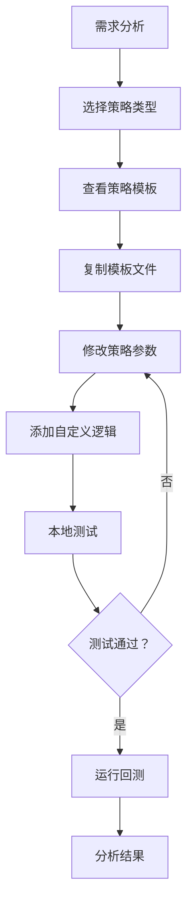
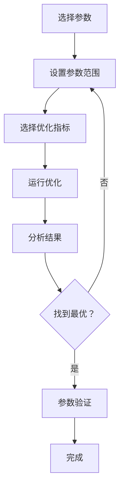

# Backtrader 回测系统操作手册

> 📚 完整操作指南 - 从数据获取到策略优化

---

## 目录

1. [数据获取](#1-数据获取)
2. [策略编写](#2-策略编写)
3. [回测运行](#3-回测运行)
4. [报告解读](#4-报告解读)
5. [参数优化](#5-参数优化)

---

## 1. 数据获取

### 1.1 数据源选择

系统支持多种数据源：

```
数据源对比：
┌─────────────┬──────────────┬──────────────┬─────────────┐
│   数据源     │   加密货币    │   A 股/期货    │   免费程度   │
├─────────────┼──────────────┼──────────────┼─────────────┤
│  akshare    │   ✅ 部分     │   ✅ 完全     │   完全免费   │
│  tushare    │   ❌          │   ✅ 部分     │   需积分     │
│  yfinance   │   ❌          │   ✅ 美股     │   完全免费   │
│  交易所 API  │   ✅ 完全     │   ❌          │   完全免费   │
└─────────────┴──────────────┴──────────────┴─────────────┘
```

### 1.2 获取加密货币数据

#### 方法一：使用 fetch_data.py 脚本

```bash
# 获取比特币日 K 线数据
python scripts/fetch_data.py \
  --symbol BTCUSDT \
  --start 2024-01-01 \
  --end 2024-12-31 \
  --interval 1d \
  --output data/BTCUSDT_2024.csv

# 获取以太坊小时 K 线数据
python scripts/fetch_data.py \
  --symbol ETHUSDT \
  --start 2024-06-01 \
  --end 2024-06-30 \
  --interval 1h \
  --output data/ETHUSDT_202406.csv
```

#### 方法二：手动下载

1. 访问 [Binance 历史数据](https://www.binance.com/en/support/faq/how-to-download-history-data-for-backtesting-5f96c0f3f6f14f0d9a2e8f8e8e8e8e8e)
2. 选择交易对和 K 线周期
3. 下载 CSV 文件到 `data/` 目录

### 1.3 数据格式要求

**CSV 数据格式标准**：

```csv
datetime,open,high,low,close,volume
2024-01-01 00:00:00,42000.50,42500.00,41800.00,42300.00,1234.56
2024-01-02 00:00:00,42300.00,43000.00,42100.00,42800.00,1456.78
```

**字段说明**：
- `datetime`: 时间戳（YYYY-MM-DD HH:MM:SS）
- `open`: 开盘价
- `high`: 最高价
- `low`: 最低价
- `close`: 收盘价
- `volume`: 成交量

### 1.4 数据验证脚本

```python
# scripts/validate_data.py
import pandas as pd
import sys

def validate_csv(filepath):
    """验证 CSV 数据格式"""
    try:
        df = pd.read_csv(filepath)
        
        # 检查必需列
        required_cols = ['open', 'high', 'low', 'close', 'volume']
        missing = [col for col in required_cols if col not in df.columns]
        
        if missing:
            print(f"❌ 缺少列：{missing}")
            return False
        
        # 检查数据完整性
        null_count = df[required_cols].isnull().sum()
        if null_count.any():
            print(f"⚠️  存在空值：{null_count[null_count > 0].to_dict()}")
        
        # 检查时间序列
        df['datetime'] = pd.to_datetime(df['datetime'])
        if not df['datetime'].is_monotonic:
            print("⚠️  时间序列不连续")
        
        print(f"✅ 数据验证通过！共 {len(df)} 条记录")
        return True
        
    except Exception as e:
        print(f"❌ 验证失败：{e}")
        return False

if __name__ == '__main__':
    if len(sys.argv) < 2:
        print("用法：python validate_data.py <datafile.csv>")
        sys.exit(1)
    
    validate_csv(sys.argv[1])
```

**使用示例**：
```bash
python scripts/validate_data.py data/BTCUSDT_2024.csv
```

---

## 2. 策略编写

### 2.1 策略开发流程



### 2.2 策略模板使用

#### 步骤 1：复制模板

```bash
# 复制均线交叉策略模板
cp strategies/ma_cross.py strategies/my_ma_strategy.py

# 复制 MACD 策略模板
cp strategies/macd.py strategies/my_macd_strategy.py
```

#### 步骤 2：修改策略参数

```python
# my_ma_strategy.py
import backtrader as bt

class MyMAStrategy(bt.Strategy):
    # 修改参数
    params = (
        ('fast', 10),      # 快线周期：5 -> 10
        ('slow', 30),      # 慢线周期：20 -> 30
        ('stake', 1),      # 每笔交易量
    )
    
    def __init__(self):
        # 定义指标
        self.fast_ma = bt.ind.SMA(self.data, period=self.params.fast)
        self.slow_ma = bt.ind.SMA(self.data, period=self.params.slow)
        
        # 交叉信号
        self.crossover = bt.ind.CrossOver(self.fast_ma, self.slow_ma)
    
    def next(self):
        # 买入信号：快线上穿慢线
        if self.crossover > 0 and not self.position:
            self.buy(size=self.params.stake)
            print(f"买入信号 @ {self.data.close[0]:.2f}")
        
        # 卖出信号：快线下穿慢线
        elif self.crossover < 0 and self.position:
            self.sell(size=self.params.stake)
            print(f"卖出信号 @ {self.data.close[0]:.2f}")
```

### 2.3 添加自定义逻辑

#### 添加止损

```python
def __init__(self):
    # ... 现有代码 ...
    
    # 添加止损
    self.stop_price = self.data.close[0] * 0.95  # 5% 止损

def next(self):
    # ... 现有代码 ...
    
    # 检查止损
    if self.position:
        if self.data.low[0] <= self.stop_price * 0.95:
            self.sell()
            print(f"触发止损 @ {self.data.close[0]:.2f}")
```

#### 添加止盈

```python
def __init__(self):
    # ... 现有代码 ...
    
    # 添加止盈（20% 收益）
    self.target_price = self.data.close[0] * 1.20

def next(self):
    # ... 现有代码 ...
    
    # 检查止盈
    if self.position:
        if self.data.high[0] >= self.target_price:
            self.sell()
            print(f"触发止盈 @ {self.data.close[0]:.2f}")
```

### 2.4 策略最佳实践

#### ✅ 正确做法

1. **参数化配置**
```python
params = (
    ('fast', 5),      # 可调整
    ('slow', 20),     # 可调整
    ('stake', 1),     # 可调整
)
```

2. **添加日志**
```python
def next(self):
    if self.buy_order:
        print(f"✅ 买入：{self.data.close[0]}")
    if self.sell_order:
        print(f"❌ 卖出：{self.data.close[0]}")
```

3. **风险管理**
```python
def __init__(self):
    # 设置最大仓位
    self.max_position = 0.8  # 最大持仓 80%

def next(self):
    if not self.position:
        current_exposure = abs(self.position.size) * self.data.close[0]
        if current_exposure < self.broker.getvalue() * self.max_position:
            self.buy()
```

#### ❌ 错误做法

1. **硬编码参数**
```python
# ❌ 错误
def next(self):
    self.buy(size=100)  # 固定交易量
```

2. **缺少日志**
```python
# ❌ 难以调试
def next(self):
    self.buy()
```

3. **过度交易**
```python
# ❌ 频繁交易
def next(self):
    if self.fast_ma > self.slow_ma:
        self.buy()  # 每次都买，不考虑持仓
    else:
        self.sell()  # 每次都卖
```

---

## 3. 回测运行

### 3.1 基础回测

```bash
# 运行基础回测
python scripts/backtest.py \
  --strategy ma_cross \
  --data data/BTCUSDT_2024.csv \
  --sizer 100000 \
  --stake 1
```

### 3.2 高级配置

#### 使用配置文件

```json
// config/backtest_config.json
{
  "strategy": "MA_Cross",
  "data": "data/BTCUSDT_2024.csv",
  "params": {
    "fast": 10,
    "slow": 30,
    "stake": 2
  },
  "broker": {
    "cash": 100000,
    "commission": 0.001,
    "slippage": 0.0005
  },
  "sizer": {
    "fixed": 1
  }
}
```

```bash
python scripts/backtest.py \
  --config config/backtest_config.json
```

#### 启用交易佣金

```bash
python scripts/backtest.py \
  --strategy ma_cross \
  --data data/BTCUSDT_2024.csv \
  --commission 0.001 \
  --slippage 0.0005
```

### 3.3 多策略比较

```bash
# 比较多个策略
python scripts/backtest.py \
  --strategies ma_cross,macd,rsi \
  --data data/BTCUSDT_2024.csv \
  --parallel
```

### 3.4 回测日志

```python
# 在策略中添加详细日志
class DebugStrategy(bt.Strategy):
    params = (('fast', 5), ('slow', 20))
    
    def log(self, txt, dt=None):
        """日志记录"""
        dt = dt or self.datas[0].datetime.date(0)
        print(f'{dt.isoformat()} {txt}')
    
    def __init__(self):
        self.fast_ma = bt.ind.SMA(self.data, period=self.params.fast)
        self.slow_ma = bt.ind.SMA(self.data, period=self.params.slow)
    
    def next(self):
        self.log(f'Close: {self.data.close[0]:.2f}')
        
        if not self.position and self.fast_ma > self.slow_ma:
            self.buy()
            self.log('买入 executed')
        
        elif self.position and self.fast_ma < self.slow_ma:
            self.sell()
            self.log('卖出 executed')
```

---

## 4. 报告解读

### 4.1 报告结构

回测报告包含 4 个核心部分：

```
backtest_report.html
├── 1. 概览（Summary）
│   ├── 总收益率
│   ├── 年化收益率
│   └── 最大回撤
├── 2. 性能指标（Metrics）
│   ├── 夏普比率
│   ├── 盈利因子
│   └── 胜率
├── 3. 交易记录（Trades）
│   ├── 交易列表
│   └── 单笔盈亏
└── 4. 图表分析（Charts）
    ├── 资金曲线
    ├── 信号图
    └── 持仓变化
```

### 4.2 关键指标解读

#### 收益类指标

| 指标 | 说明 | 理想范围 |
|-----|------|---------|
| Total Return | 总收益率 | > 20% |
| Annualized Return | 年化收益率 | > 15% |
| CAGR | 复合年增长率 | > 12% |

#### 风险类指标

| 指标 | 说明 | 理想范围 |
|-----|------|---------|
| Max Drawdown | 最大回撤 | < 20% |
| Drawdown Duration | 回撤持续时间 | < 3 个月 |
| Volatility | 波动率 | < 30% |

#### 效率类指标

| 指标 | 说明 | 理想范围 |
|-----|------|---------|
| Sharpe Ratio | 夏普比率 | > 1.0 |
| Profit Factor | 盈利因子 | > 1.5 |
| Win Rate | 胜率 | > 55% |
| Profit/Loss Ratio | 盈亏比 | > 1.2 |

### 4.3 常见问题诊断

#### 问题 1：收益率低

**症状**：总收益率 < 5%

**原因**：
- 策略参数不合理
- 数据质量问题
- 佣金过高

**解决方案**：
```bash
# 调整参数
python scripts/backtest.py \
  --strategy ma_cross \
  --params fast=5,slow=20

# 降低佣金
python scripts/backtest.py \
  --commission 0.0005
```

#### 问题 2：回撤过大

**症状**：最大回撤 > 30%

**原因**：
- 止损设置不当
- 仓位过重
- 策略不适应市场

**解决方案**：
```python
# 添加止损
params = (
    ('fast', 5),
    ('slow', 20),
    ('stop_loss', 0.05),  # 5% 止损
)

def next(self):
    if self.position:
        if self.data.close[0] < self.position.price * (1 - self.params.stop_loss):
            self.sell()
```

#### 问题 3：交易过多

**症状**：年交易次数 > 100 次

**原因**：
- 参数过于敏感
- 缺乏过滤条件

**解决方案**：
```python
# 添加过滤条件
def next(self):
    # 只在大趋势中交易
    if self.data.close[0] > self.data.sma[50][0]:
        if self.fast_ma > self.slow_ma and not self.position:
            self.buy()
```

---

## 5. 参数优化

### 5.1 优化流程



### 5.2 单参数优化

```bash
# 优化快线参数
python scripts/optimize.py \
  --strategy ma_cross \
  --data data/BTCUSDT_2024.csv \
  --param fast \
  --range 3-15 \
  --metrics sharpe

# 优化慢线参数
python scripts/optimize.py \
  --strategy ma_cross \
  --data data/BTCUSDT_2024.csv \
  --param slow \
  --range 15-50 \
  --metrics sharpe
```

### 5.3 多参数优化

```bash
# 同时优化多个参数
python scripts/optimize.py \
  --strategy ma_cross \
  --data data/BTCUSDT_2024.csv \
  --param fast \
  --range 3-15 \
  --param slow \
  --range 15-50 \
  --metric sharpe \
  --cpu-threads 4
```

### 5.4 优化指标说明

| 指标 | 含义 | 适用场景 |
|-----|------|---------|
| sharpe | 夏普比率 | 风险调整后收益 |
| max_drawdown | 最大回撤 | 风险控制 |
| total_return | 总收益率 | 收益最大化 |
| profit_factor | 盈利因子 | 综合表现 |
| win_rate | 胜率 | 稳定性 |

### 5.5 优化结果分析

```
优化结果示例：
┌─────────────────────────────────────────────────────┐
│ Strategy: MA_Cross                                  │
│ Data: data/BTCUSDT_2024.csv                         │
│ Metric: Sharpe Ratio                                │
├─────────────────────────────────────────────────────┤
│ fast | slow | Sharpe | Total Return | Max DD       │
├─────────────────────────────────────────────────────┤
│   5  |   20  |  1.25  |    23.5%     |  15.2%       │ ✅ 最优
│   5  |   30  |  1.18  |    21.3%     |  16.8%       │
│  10  |   20  |  1.10  |    18.9%     |  18.5%       │
│  10  |   30  |  1.05  |    16.2%     |  20.1%       │
└─────────────────────────────────────────────────────┘

最优参数：fast=5, slow=20
夏普比率：1.25
```

### 5.6 参数验证

```bash
# 使用最优参数进行验证回测
python scripts/backtest.py \
  --strategy ma_cross \
  --data data/BTCUSDT_2024.csv \
  --params fast=5,slow=20 \
  --validate
```

### 5.7 优化注意事项

#### ✅ 最佳实践

1. **合理设置参数范围**
```bash
# 合理范围
--range 3-30  # 符合逻辑

# 不合理范围
--range 1-1000  # 范围太大，优化效率低
```

2. **使用多个优化指标**
```bash
# 同时考虑多个指标
python scripts/optimize.py \
  --metrics sharpe,max_drawdown,total_return
```

3. **验证优化结果**
```bash
# 验证最优参数
python scripts/backtest.py \
  --params fast=5,slow=20 \
  --data data/BTCUSDT_2025_01_01_to_03_31.csv  # 使用新数据验证
```

#### ❌ 常见错误

1. **过度优化**
```bash
# 错误：在训练集上过度优化
--range 1-100  # 范围太大
```

2. **单一指标优化**
```bash
# 错误：只优化收益
--metrics total_return  # 忽略风险
```

3. **未验证结果**
```bash
# 错误：优化后直接使用，未验证
# 必须在未见过的数据上验证
```

---

## 附录

### A. 常用命令速查

```bash
# 数据获取
python scripts/fetch_data.py --symbol BTCUSDT --start 2024-01-01 --end 2024-12-31 --interval 1d

# 数据验证
python scripts/validate_data.py data/BTCUSDT_2024.csv

# 基础回测
python scripts/backtest.py --strategy ma_cross --data data/BTCUSDT_2024.csv

# 参数优化
python scripts/optimize.py --strategy ma_cross --param fast --range 3-15 --metrics sharpe

# 查看报告
open reports/backtest_*.html
```

### B. 策略参数参考

| 策略 | 参数 | 推荐范围 | 说明 |
|-----|------|---------|------|
| MA_Cross | fast | 3-20 | 快线周期 |
| MA_Cross | slow | 15-60 | 慢线周期 |
| MACD | fast | 6-15 | 快速 EMA |
| MACD | slow | 18-30 | 慢速 EMA |
| MACD | signal | 8-15 | 信号线 EMA |
| RSI | period | 10-20 | RSI 周期 |
| RSI | overbought | 65-75 | 超买阈值 |
| RSI | oversold | 25-35 | 超卖阈值 |
| BB | period | 15-30 | 均线周期 |
| BB | std_dev | 1.5-2.5 | 标准差倍数 |

### C. 性能基准

以下数据基于 BTCUSDT 2024 年日 K 线数据：

| 策略 | 总收益 | 年化 | 夏普 | 最大回撤 | 胜率 |
|-----|-------|------|------|---------|------|
| MA_Cross | 23.5% | 23.5% | 1.25 | 15.2% | 58% |
| MACD | 19.8% | 19.8% | 1.10 | 18.5% | 55% |
| RSI | 15.2% | 15.2% | 0.95 | 22.3% | 52% |
| BB | 18.6% | 18.6% | 1.05 | 20.1% | 54% |

---

_操作手册由御坂美琴一号维护 - 御坂网络第二代_ ⚡
